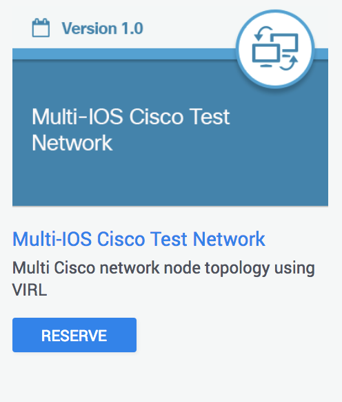
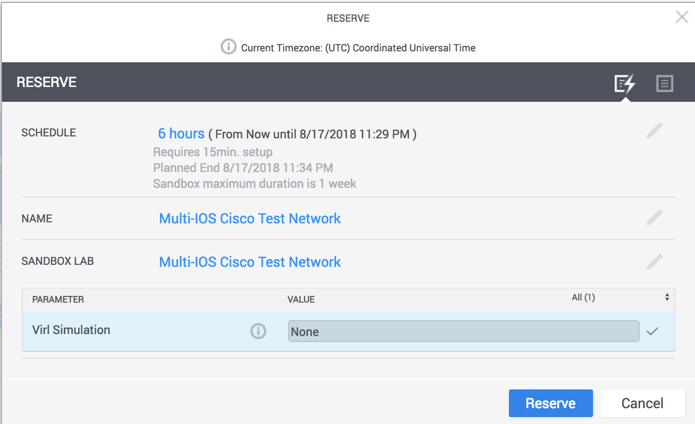

# sbx_multiios

Sample code, examples, and resources for use with the [DevNet Multi-IOS Sandbox](https://devnetsandbox.cisco.com/RM/Diagram/Index/6b023525-4e7f-4755-81ae-05ac500d464a?diagramType=Topology)



### Reserve a sandbox lab.

You can reserve a sandbox lab [here](https://devnetsandbox.cisco.com/RM/Diagram/Index/6b023525-4e7f-4755-81ae-05ac500d464a?diagramType=Topology). During the reservation, you can select "None" for
simulation, as we will be launching the required topologies as part of the setup.

It takes about 15 minutes to spin up the VIRL servers and your devbox.  Hang tight and do some emails.




# Setup

Here's a video overview of the process... from here feel free to press fast forward in the middle...

[](https://asciinema.org/a/5OZEo29CwO2PiWhV7T1nW1QgF)


## Detailed instructions.

### Step 1. Connect to devbox

After your reservation is complete you will receive and email with credential to
connect to the sandbox via VPN.  Once connected you can ssh to the devbox using the following credentials: `developer/C1sco12345`

    ssh developer@10.10.20.20

### Step 2: Clone this repository

```
git clone --recurse-submodules https://github.com/DevNetSandbox/sbx_multi_ios.git
```

### Step 3: Setup GitLab...

```
cd sbx_multi_ios/gitlab
./setup.sh
```

### Step 3a: Refill your drink...

Seriously, this is going to take like 5 minutes...


### Step 4: Start the CICD setup...

```
cd sbx_multi_ios/cicd-3tier
./setup.sh
```

### Step 4a: Check your email

Seriously, this is going to take like 10 minutes...

### Step 5: Have Fun!


# whats here

A number of different lab environments that can be quickly stood up.

* [GitLab Community Edition](./gitlab/) - Add version control and CI/CD to your sandbox. Recommend starting here, as it's used in some of the others... don't worry it only takes a few minutes for us to set it up for you.

* [Network CI/CD Pipeline](./cicd-3tier/) - A core-distribution-access network with a CICD pipeline including GitLab, VIRL, pyATS, and NSO.  Now we're having fun..

* [Streaming Telemetry](./metrics-pig/) - Get insights by analyzing large amounts of data through visualizations using streaming telemetry using Pipeline, InfluxDB, and Grafana. Your going to want something to look at while your network is being deployed.. and lets face it, there wasn't anything good in email.

* [Log Analytics with ELK](./metrics-elk/) - Use Elasticsearch, Logstash, and Kibana (ELK) for analyzing syslog message from network devices.

# whats not

These are designed to be starting points for future tutorials, and not tutorials themselves.
