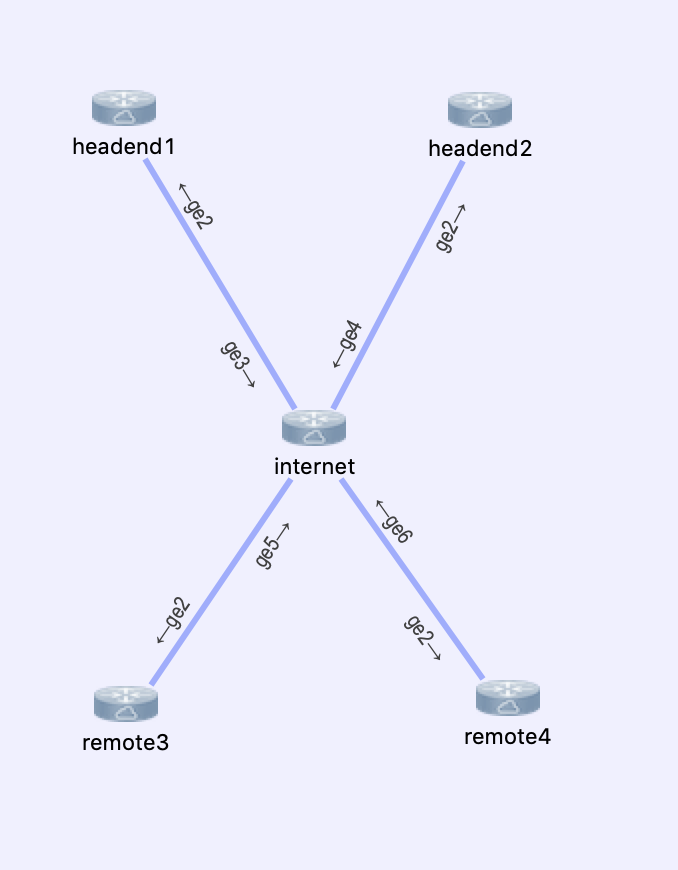

# cicd-dmvpn

A proof of concept for managing DMVPN clouds as code

## Topology

Our proof of concept includes the following topology.



## Environments

For our proof of concept we will be launching two instances of this topology, one which will be configured by Ansible, and one that will use the NSO (as well as NSO+Ansible) approaches outlined below

## Approaches

This proof of concept demonstrates how this is accomplished using three distinct
approaches.

1. Ansible - using Ansible playbooks/roles to provision devices.  This proof of concept deploys `dmvpn1` and `dmvpn2` a.k.a `Tunnel1` and `Tunnel2` interfaces
2. NSO - using Cisco Network Services Orchestrator to provision devices
3. Better Together - uses a combination of NSO and Ansible to provision


## Ansible Approach

To fully deploy the network using Ansible, execute the following command from the devbox.

```
./ansible_setup.sh
```

This will take a few minutes to complete, we recommend that you take a few moments to review the contents of [./ansible_setup.sh](./ansible_setup.sh) to get a feel for what is happening behind the scenes

The high level steps that are being performed here are

  * Launch simulated network instance using Cisco VIRL
  * Generates an Ansible inventory based on the running Simulation
  * Executes the [main playbook](./site.yaml) which contains [roles](./roles) which define the tasks, configuration templates, and logic applied to [headened routers](./roles/headend_router) and [remote routers](./roles/remote_router)

At the end of this process you should be able to login to the various topologies to explore the configurations further.

To access the nodes in this environment, do the following

```
cd virl/sandbox
virl nodes ansible
```

You should see output similar the following:

```
[developer@devbox ~]$ virl nodes ansible
Here is a list of all the running nodes
╒══════════╤══════════╤═════════╤═════════════╤════════════╤══════════════════════╤════════════════════╕
│ Node     │ Type     │ State   │ Reachable   │ Protocol   │ Management Address   │ External Address   │
╞══════════╪══════════╪═════════╪═════════════╪════════════╪══════════════════════╪════════════════════╡
│ remote4  │ CSR1000v │ ACTIVE  │ REACHABLE   │ telnet     │ 172.16.30.101        │ N/A                │
├──────────┼──────────┼─────────┼─────────────┼────────────┼──────────────────────┼────────────────────┤
│ headend1 │ CSR1000v │ ACTIVE  │ REACHABLE   │ telnet     │ 172.16.30.97         │ N/A                │
├──────────┼──────────┼─────────┼─────────────┼────────────┼──────────────────────┼────────────────────┤
│ headend2 │ CSR1000v │ ACTIVE  │ REACHABLE   │ telnet     │ 172.16.30.98         │ N/A                │
├──────────┼──────────┼─────────┼─────────────┼────────────┼──────────────────────┼────────────────────┤
│ remote3  │ CSR1000v │ ACTIVE  │ REACHABLE   │ telnet     │ 172.16.30.100        │ N/A                │
├──────────┼──────────┼─────────┼─────────────┼────────────┼──────────────────────┼────────────────────┤
│ internet │ CSR1000v │ ACTIVE  │ REACHABLE   │ telnet     │ 172.16.30.99         │ N/A                │
╘══════════╧══════════╧═════════╧═════════════╧════════════╧══════════════════════╧════════════════════╛
```

From this point forward nodes can be accessed using the following commands

  * `virl ssh ansible headend1`
  * `virl ssh ansible headend2`
  * `virl ssh ansible remote3`
  * `virl ssh ansible remote4`


## NSO Approach (and NSO+Ansible Approach)

To fully deploy the network using NSO, execute the following command from the devbox.

```
./nso_setup.sh
```

This will take a few minutes to complete, we recommend that you take a few moments to review the contents of [./nso_setup.sh](./nso_setup.sh) to get a feel for what is happening behind the scenes

The high level steps that are being performed here are

  * Launch simulated network instance using Cisco VIRL
  * Launches an instance of NSO on the devbox
  * Deploys a DMVPN [cloud30](./samples/nso/cloud30.yaml) using an [ansible playbook](./samples/nso/cloud30-playbook.yaml)
  * Deploys a DMVPN [cloud40](./samples/nso/cloud40.yaml) by using NSO's nortbound REST API and a simple [python script](./samples/nso/deploy-cloud40.py)

At the end of this process you should be able to login to the various topologies to explore the configurations further.

To access the nodes in this environment, do the following

```
cd virl/sandbox
virl nodes nso
```

You should see output similar to the following

```
[developer@devbox sandbox]$ virl nodes nso
Here is a list of all the running nodes
╒══════════╤══════════╤═════════╤═════════════╤════════════╤══════════════════════╤════════════════════╕
│ Node     │ Type     │ State   │ Reachable   │ Protocol   │ Management Address   │ External Address   │
╞══════════╪══════════╪═════════╪═════════════╪════════════╪══════════════════════╪════════════════════╡
│ remote3  │ CSR1000v │ ACTIVE  │ REACHABLE   │ telnet     │ 172.16.30.105        │ N/A                │
├──────────┼──────────┼─────────┼─────────────┼────────────┼──────────────────────┼────────────────────┤
│ remote4  │ CSR1000v │ ACTIVE  │ REACHABLE   │ telnet     │ 172.16.30.106        │ N/A                │
├──────────┼──────────┼─────────┼─────────────┼────────────┼──────────────────────┼────────────────────┤
│ headend1 │ CSR1000v │ ACTIVE  │ REACHABLE   │ telnet     │ 172.16.30.102        │ N/A                │
├──────────┼──────────┼─────────┼─────────────┼────────────┼──────────────────────┼────────────────────┤
│ internet │ CSR1000v │ ACTIVE  │ REACHABLE   │ telnet     │ 172.16.30.104        │ N/A                │
├──────────┼──────────┼─────────┼─────────────┼────────────┼──────────────────────┼────────────────────┤
│ headend2 │ CSR1000v │ ACTIVE  │ REACHABLE   │ telnet     │ 172.16.30.103        │ N/A                │
╘══════════╧══════════╧═════════╧═════════════╧════════════╧══════════════════════╧════════════════════╛
```

From this point forward nodes can be accessed using the following commands

  * `virl ssh nso headend1`
  * `virl ssh nso headend2`
  * `virl ssh nso remote3`
  * `virl ssh nso remote4`


```
virl ssh nso remote3

remote3#show ip eigrp neigh
EIGRP-IPv4 Neighbors for AS(100)
H   Address                 Interface              Hold Uptime   SRTT   RTO  Q  Seq
                                                   (sec)         (ms)       Cnt Num
1   192.168.40.1            Tu40                     13 00:15:05    2  1398  0  8
0   192.168.30.1            Tu30                     11 00:15:22   63  1398  0  13
```
