# Visualizing Telemetry Data with Grafana


A few notes about the lab guide:

???+ example "Output"
    This type of box is meant to describe output you will see if you run the commands given to you, useful if you are just reading the lab guide, or want to verify what you are seeing.

???+ info "Info"
    This type of box is meant to represent file or config data

## Overview

Collecting data for analyzing and troubleshooting has always been an important aspect in monitoring the health of a network. Cisco NX-OS provides several mechanisms such as SNMP, CLI, and Syslog to collect data from a network.  These mechanisms have limitations that restrict automation and scale.  One limitation is the use of the pull model, where the initial request for data from network elements originates from the client.  The pull model does not scale when there is more than one network management station(NMS) in the network.  With this model, the server sends data only when clients request it. To initiate such requests, continual manual intervention is required.  This continual manual intervention makes the pull model inefficient. A push model continuously streams data out of the network and notifies the client.  Telemetry enables the push model, which provides near-real-time access to monitoring data.

Devices can many different types of data as telemetry, metrics, status, etc. In this lab we will be graphing metrics over time using [Grafana](https://grafana.com/).

We will review the components needed to collect this pushed data using an open-source stack.

In this lab we will be leveraging some pre-built components but you can dig into them further by expending the "info" boxes.


## Topology

We will be using [virlfiles/3nx](https://github.com/virlfiles/3nx) as the topology for this lab. Overall the topology isn't too important in this exercise.  We just need an OS that supports telemetry (NXOSv) and we will leverage Devbox inside the DevnetSandbox to host our telemetry stack.

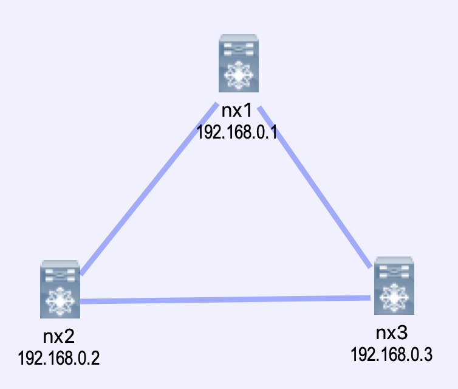

### The Telemetry Stack

In our use case we are wanting to visualize data using graphs over time.  We chose [Grafana](https://grafana.com/) to build the graphs.  

[InfluxDB](https://www.influxdata.com/) was our chosen tool to store data.  As a time series database it makes it very easy to write time based queries.

[Pipeline](https://github.com/cisco-ie/pipeline-gnmi) is our telemetry receiver.  It is responsible for receiving data, parsing it, and transforming it into a format we can store inside of InfluxDB

We have used docker-compose to make this stack easy to deploy in a predictable manor.

## Pre-reqs

!!! danger "You must have the Cisco Devnet sbx_multi_ios sandbox checked out and gone through the [sanbox setup](../sandbox-setup)"
    If you are doing this lab at an event (DevNet, Cisco Live, VT, etc) this step may have been completed for you. Check with your proctor for access instructions.

## Lab Setup

!!! info "All steps presnted in this guide are written to be completed from the devbox"


1. ssh to devbox `ssh developer@10.10.20.20` (password C1sco12345)

2. Clone the required code and change into the correct directory
```
git clone https://github.com/DevNetSandbox/sbx_multi_ios
cd sbx_multi_ios/metrics-grafana
```

3. Launch the lab environment

!!! info "This may take some time as we are launching a VIRL simulation"
```
make lab
```

This step may take a few minutes while we get things setup.  You can take a look at the Makefile to see what we are doing to setup the environment.

You should see output similar to the following:

!!! bug "TODO"
    Add 'make lab' output

???+ example "Output"

At this point we have a running VIRL simulation, a full containerized telemetry stack, and we are ready to get started.

???+ info "Looking under the covers"
    If you want to see what we have going on behind the scenes in the lab run 'virl nodes' and 'make stackstatus'

    ???+ example "virl nodes"
        ```
        [developer@devbox metrics-pig-nx]$virl nodes
        Here is a list of all the running nodes
        ╒════════╤═════════════╤═════════╤═════════════╤════════════╤══════════════════════╤════════════════════╕
        │ Node   │ Type        │ State   │ Reachable   │ Protocol   │ Management Address   │ External Address   │
        ╞════════╪═════════════╪═════════╪═════════════╪════════════╪══════════════════════╪════════════════════╡
        │ nx1    │ NX-OSv 9000 │ ACTIVE  │ REACHABLE   │ telnet     │ 172.16.30.65         │ N/A                │
        ├────────┼─────────────┼─────────┼─────────────┼────────────┼──────────────────────┼────────────────────┤
        │ nx2    │ NX-OSv 9000 │ ACTIVE  │ REACHABLE   │ telnet     │ 172.16.30.66         │ N/A                │
        ├────────┼─────────────┼─────────┼─────────────┼────────────┼──────────────────────┼────────────────────┤
        │ nx3    │ NX-OSv 9000 │ ACTIVE  │ REACHABLE   │ telnet     │ 172.16.30.67         │ N/A                │
        ╘════════╧═════════════╧═════════╧═════════════╧════════════╧══════════════════════╧════════════════════╛
        ```

    ???+ example "make stack-status"
        ```
        [developer@devbox telemetry-stack]$docker-compose ps
                      Name                             Command               State                       Ports
        ---------------------------------------------------------------------------------------------------------------------------
        telemetrystack_elasticsearch_1      /usr/local/bin/docker-entr ...   Up      0.0.0.0:9200->9200/tcp, 0.0.0.0:9300->9300/tcp
        telemetrystack_grafana_1            /run.sh                          Up      0.0.0.0:3000->3000/tcp
        telemetrystack_influxdb_1           /entrypoint.sh influxd           Up      0.0.0.0:8083->8083/tcp, 0.0.0.0:8086->8086/tcp
        telemetrystack_prometheus_1         /bin/prometheus -config.fi ...   Up      0.0.0.0:9090->9090/tcp
        telemetrystack_unified-pipeline_1   /bin/sh -c ./startup.sh          Up      0.0.0.0:57500->57500/tcp
        ```


## Telemetry Components Overview
There are four major components of telemetry we need to outline before we get started.

### Data Collection
Telemetry data is collected from a few possible sources:

* Data Management Engine (DME) - This data can be collected periodically or only when a change is made to the specified path
* NX-API - This data can be collected periodically
* YANG

!!! note "We will only be exploring NX-API and DME in this lab"

### Data Encoding
The telemetry encoder encapsulates the collected data into the desired format.  For NXOS we have the following options:

* Google Protocol Buffers (GPB) - Protocol buffers are Google's language-neutral, platform-neutral, extensible mechanism for serializing structured data – think XML, but smaller, faster, and simpler. You define how you want your data to be structured once, then you can use special generated source code to easily write and read your structured data to and from a variety of data streams and using a variety of languages.
* JSON - (JavaScript Object Notation) is a lightweight data-interchange format. It is easy for humans to read and write. It is easy for machines to parse and generate

!!! note "Why use one vs. another?"
    JSON is easy to read, maintain and change.  GPB is lightweight and faster to process.

    In this lab it doesn't matter much. However at this point in time with telemetry you will be deciding based upon the capabilities of the device sending telemetry, and the capabilities of the telemetry receiver.

    Assuming you can choose between both, at scale GPB is likely where you want to lean.  Less bits on the wire.


### Data Transport

NXOS supports the following Data Transports with the following encodings:

Transport | Encoding |
--- | ---
HTTP | JSON
gRPC | GPB
UDP | JSON, GPB


### Telemetry Receiver
The telemetry receiver is a remote system that ingests and stores the telemetry data.  

In our lab we will be leveraging [Pipeline](https://github.com/cisco-ie/pipeline-gnmi) as the telemetry reciever.  Pipeline will store its data as metrics in InfluxDB.


## Nexus Telemetry Setup
To begin we need to setup telemetry collection on our Nexus devices.

We have created sample configuration to get you started that is already setup for parsing my our telemetry receiver (Pipeline).

!!! note "The data parsing can be tedious and requires rebuilds of the Pipeline container, so it will not be addressed in this lab"


In our example we have setup 2 sensor groups and 1 destination group:

* **destination-group 100** - This group points to Devbox port 57500 where our telemetry receiver is listening.  We are transporting data encoded in GPB over gRPC
* **sensor-group 100** - This group uses the DME
* **sensor-group 200** - This group uses NX-API
* **subscription 200** - This binds the sensor group and destination group together.  In this example we are sampling every 20 seconds, just so we don't crush our devbox.  We can easily overwhelm a telemetry receiver with data.

Copy the content of `sample-nxos-config.txt` and apply it to nx1, nx2, and nx3.  We will use virlutils to ssh into the devices.

You can find the NXOS config in `sample-nxos-config.txt`

??? example "sample-nxos-config.txt"
    ```
    feature nxapi
    feature telemetry

    telemetry
      destination-profile
        use-vrf management
      destination-group 100
        ip address 10.10.20.20 port 57500 protocol gRPC encoding GPB
      sensor-group 200
        data-source NX-API
        path "show ip route summary"
        path "show system resources"
        path "show interface mgmt0"
      subscription 200
        dst-grp 100
        snsr-grp 200 sample-interval 20000
    ```

| Credentials | |
| --- | --- |
| username | admin |
| password | cisco |

```
cp sample-nxos-config.txt
virl ssh nx1
```

Explore some `show telemetry` commands.  You should see if we are successfully sending telemetry data.

## Pipeline Overview
[Pipeline](https://github.com/cisco/bigmuddy-network-telemetry-pipeline) is an open source telemetry receiver for IOS XR and NXOS.

Pipeline supports many different input transports including:

* TCP
* gRPC
* UDP
* Apache Kafka

It also supports the following encoding:

* st
* GPB, both Compact and K/V
* JSON

From an output perspective Pipeline supports Apache Kafka, gRPC, but most importantly in our stack Metrics Extraction.  This allows us to connect pipeline to a Time Series Database (TSDB), in this case InfluxDB.  We can then layer on other visualization tools to view the data, like Grafana.

The 3 main components of Pipeline are:

* `pipeline.bin` - Pipeline's binary
* `pipeline.conf` - inbound and outbound config for pipeline. The key components within the file are `[gRPCDialout]` and `[influxdb]`.  The `[inspector]` is a tap that allows us to dump the inbound telemetry data to a file to allow us to see what is being sent, so we can setup our parser in the `metrics.json` file.


!!! info "pipeline.conf"
    ```
    [default]

    id = unified-pipeline


    [gRPCDialout]
    stage = xport_input
    type = grpc
    encap = gpb
    listen = :57500

    datachanneldepth = 1000

    [inspector]
    stage=xport_output
    type=tap
    file=telemetry_model_raw.txt


    [influxdb]
    stage = xport_output
    type = metrics
    file = /etc/pipeline/metrics_gpb.json
    dump = metricsdump.txt
    username=cisco
    password=VXJIodGD1ABLKJYg1Xcsdj6goVgezhtVX44zIO9ha1pPOK09WyfeTq+7HdJ8gKdgxPcXxsbuiZsQ0JYJ8KFcMHPdjy/V5F76Wc9qwm7f6+NeFca7XaiTIr1t4rwOG5cHDWooPW023v2cpiLIjQjpoeam/xyBJTKFuyPvi3/CgokXn5Hx3GCZqx1UDdikcSrh8xh3yXVkNzzSk8g2RwiBTdrlbrFEWBe1rW8SF4hapWvjZ22asvxOLF6YB6i2XUyggnHF4+oB4DLY7mqlfWUU2gibqMqCfsmZBwCnRww2+4Y1r1qZyAstd4a2orSDCtPN7sw6HyeAd6tKIj1F9UOwQWgDBnkQBGAH1Gdq9iCTF6Q/gMgN5F+g4FU9dGXQYcUw0BmlNYtRiR74ecAgDLdZ5mijIuJmaFyEdo+bIuHdXSIhc875TjoP23AnpbSA95tWsuwc7gtB0Sx165NDZwJWOOPVlNUQ4XV/PcOF+atO7GVnvfC1jcd+Ds2W9pPVWIlIbboWIjSp+vGww9lB8AWIbqFxxoM7NRJJyfzqNLJemW7De7EmuBU5rFRvYIjZi1+5x+jpERFi5Hry+YtrDWmpXBjqVi6K0InSXMk7NMVC8JByZF7V8CmheH/lIx9w9mwHnYWpwsqvPl1HTcjr4R4kuGPio5RGk88QuovjsgwIRD0=
    output = influx
    influx = http://influxdb:8086
    database = netdevops
    ```

* `metrics.json` - parser for the telemetry data

!!! info "metrics.json"
    ```
    [
    	{
    		"basepath": "Cisco-NX-OS-device:System/ospf-items/operSt",
    		"spec": {
    			"fields": [
    				{"name": "Cisco-NX-OS-device:System/ospf-items/operSt", "tag": true},
    				{
    					"name": "",
    				  "fields":
    						[
    							{"name": "operSt"}
    						]
    				}
    			]
    		}
    	},
    	{
    		"basepath": "show system resources",
    		"spec": {
    			"fields": [
    				{"name": "show system resources", "tag": true},
    				{
    					"name": "",
    					"fields":
    						[
    							{"name": "cpu_state_user"},
    							{"name": "cpu_state_kernel"},
    							{"name": "cpu_state_idle"},
    							{"name": "memory_usage_free"},
    							{"name": "memory_usage_total"},
    							{"name": "memory_usage_total"}
    						]
    				}
    			]
    		}
    	},
      ...
      ...
      ...
      ]
    ```


Lets take a look at an NX-API parsing example: `show system resources`.

First `tail` our tap file to see if we can find data from `show system resources`.
```
make tap
```

This is the raw data that is coming into pipeline from our Nexus switches.

Let's look for one from `show system resources`.  If you don't find one you can use the example below.

??? info "show system resources telemetry"
    ```
    ------- 2019-05-09 20:17:51.031108675 +0000 UTC m=+175.717736295 -------
    Summary: GPB(common) Message [172.16.30.65:23370(nx1)/show system resources msg len: 575]
    {
        "Source": "172.16.30.65:23370",
        "Telemetry": {
            "node_id_str": "nx1",
            "subscription_id_str": "200",
            "encoding_path": "show system resources",
            "collection_id": 1012,
            "collection_start_time": 0,
            "msg_timestamp": 1557433070928,
            "collection_end_time": 0
        },
        "Rows": [
            {
                "Timestamp": 0,
                "Keys": {
                    "show system resources": "show system resources"
                },
                "Content": {
                    "": {
                        "TABLE_cpu_usage": {
                            "": {
                                "ROW_cpu_usage": {
                                    "_PIPELINE_EDIT": [
                                        {
                                            "cpuid": 0,
                                            "idle": "71.13",
                                            "kernel": "13.40",
                                            "user": "15.46"
                                        },
                                        {
                                            "cpuid": 1,
                                            "idle": "83.51",
                                            "kernel": "16.48",
                                            "user": "0.00"
                                        }
                                    ]
                                }
                            }
                        },
                        "cpu_state_idle": "77.12",
                        "cpu_state_kernel": "14.89",
                        "cpu_state_user": "7.97",
                        "current_memory_status": "OK",
                        "load_avg_15min": "0.62",
                        "load_avg_1min": "0.75",
                        "load_avg_5min": "0.64",
                        "memory_usage_free": 1552392,
                        "memory_usage_total": 6066740,
                        "memory_usage_used": 4514348,
                        "processes_running": 1,
                        "processes_total": 689
                    }
                }
            }
        ]
    }
    ```

We can build our `metrics.json` file to parse this data to collect the fields we are interested in.  In this case we are looking for:

| field |
| --- |
| cpu_state_user |
| cpu_state_kernel |
| cpu_state_idle |
| memory_usage_free |
| memory_usage_total |
| memory_usage_used |

!!! info "example parser"
    ```
    {
      "basepath": "show system resources",
      "spec": {
        "fields": [
          {"name": "show system resources", "tag": true},
          {
            "name": "",
            "fields":
              [
                {"name": "cpu_state_user"},
                {"name": "cpu_state_kernel"},
                {"name": "cpu_state_idle"},
                {"name": "memory_usage_free"},
                {"name": "memory_usage_total"},
                {"name": "memory_usage_total"}
              ]
          }
        ]
      }
    },
    ```

You can see how we called out the fields we care out.  These will be sent to InfluxDB.

## InfluxDB
[InfluxDB](https://www.influxdata.com/) is an open source Time Series DB (TSDB) that we will be leveraging to store the telemetry data we are sending to Pipeline.  A TSDB is optimized around handling arrays of numbers indexed by time. This makes it a perfect companion to Grafana.

While we don't need to be InfluxDB experts to leverage it, its good to know how to check and validate your data is there.

Influx does have a web interface that you can reach at [http://10.10.20.20:8083](http://10.10.20.20:8083) but we'll just be using CURL for these examples.

First lets make sure our database got created.  We are looking for one called `netdevops`
```
curl http://10.10.20.20:8086/query?q=SHOW+DATABASES
```

??? example "Output"
    ```
    [developer@devbox telemetry-stack]$curl http://10.10.20.20:8086/query?q=SHOW+DATABASES
    {"results":[{"series":[{"name":"databases","columns":["name"],"values":[["netdevops"],["_internal"]]}]}]}
    ```

Hopefully you see the database `netdevops` in the output.  That confirms InfluxDB is setup as we need it, now lets see if we are recieving data from the switches:
```
curl -G 'http://localhost:8086/query?pretty=true' --data-urlencode "db=netdevops" --data-urlencode "q=SHOW MEASUREMENTS"
```

??? example "Output"
    ```
    [developer@devbox telemetry-stack]$curl -G 'http://localhost:8086/query?pretty=true' --data-urlencode "db=netdevops" --data-urlencode "q=SHOW MEASUREMENTS"
    {
        "results": [
            {
                "series": [
                    {
                        "name": "measurements",
                        "columns": [
                            "name"
                        ],
                        "values": [
                            [
                                "show system resources"
                            ]
                        ]
                    }
                ]
            }
        ]
    }
    ```

At this point we can see we have measurements inside our database.  If you are interested in digging into them you can find the API guide for InfluxDB [here](https://docs.influxdata.com/influxdb/v1.7/guides/querying_data/).

## Grafana
Grafana is an open source general purpose dashboard and graph composer.  We can leverage it to graph the telemetry data we are storing in Grafana.

Access Grafana by pointing your browser to `http://10.10.20.20:3000`.

### Setup
We first need to setup Grafana to read data from InfluxDB.  Log into Grafana using the username: `admin` and password: `admin`.  You can find the login icon at the bottom left of the screen.

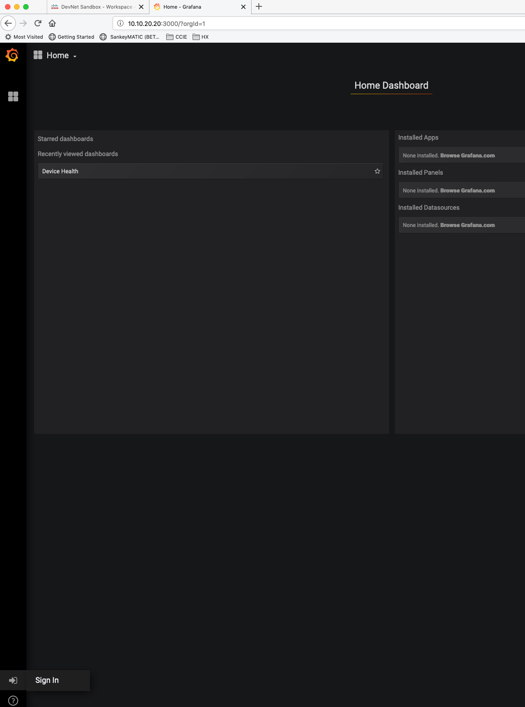

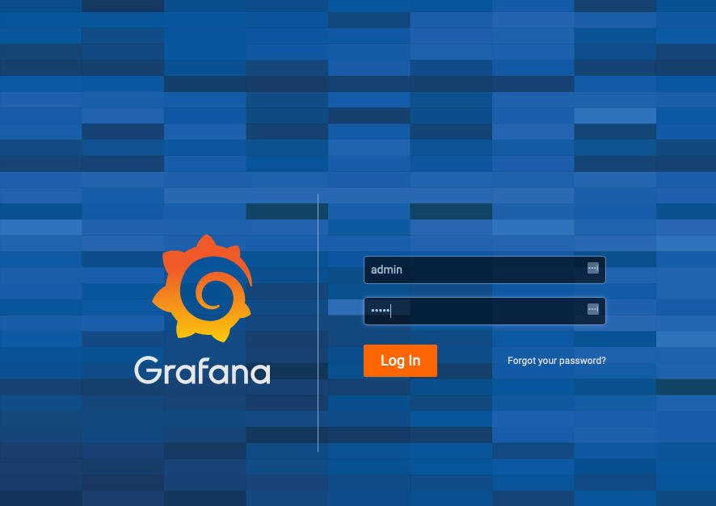

!!! note
    Grafana may ask you to change the admin password, you can safely skip this step.

After you login, you will be broght to your Home Dashboard.  Click `Create your first data source`
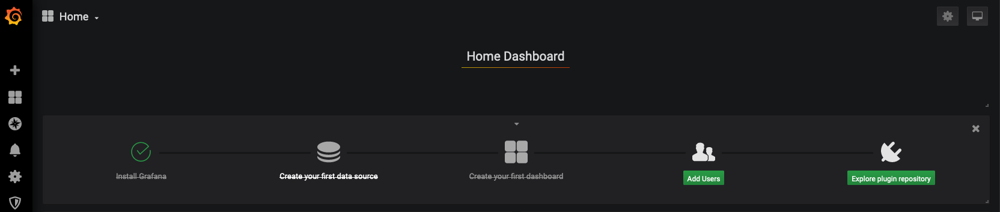

Select InfluxDB
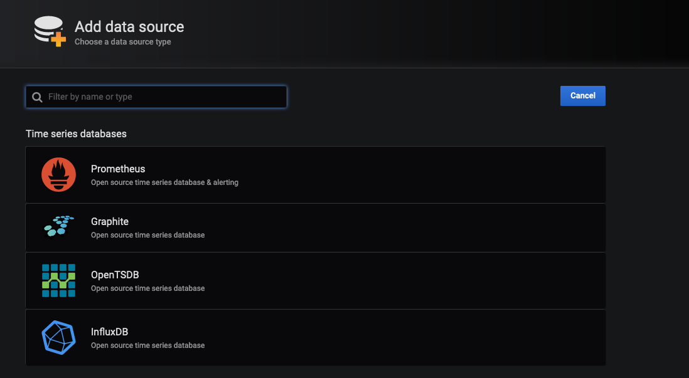

Set the following:

| field | value |
| --- | --- |
| URL | http://influx:8086 |
| Database | netdevops |
| User | cisco |
| Password | cisco |

Once you fill out the fields click the test button at the bottom.

Now that we have connected Grafana to InfluxDB we can begin to visualize the data.

### Build our First Dashboard

#### CPU Utilization

Let's build a dashboard.  Click `Create your first Dashboard`


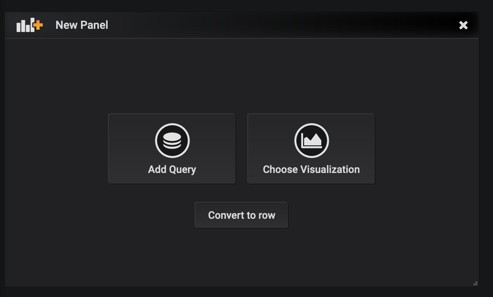

Click `Add Query`

Here we can see a live graph that will map the data we are going to query over time.
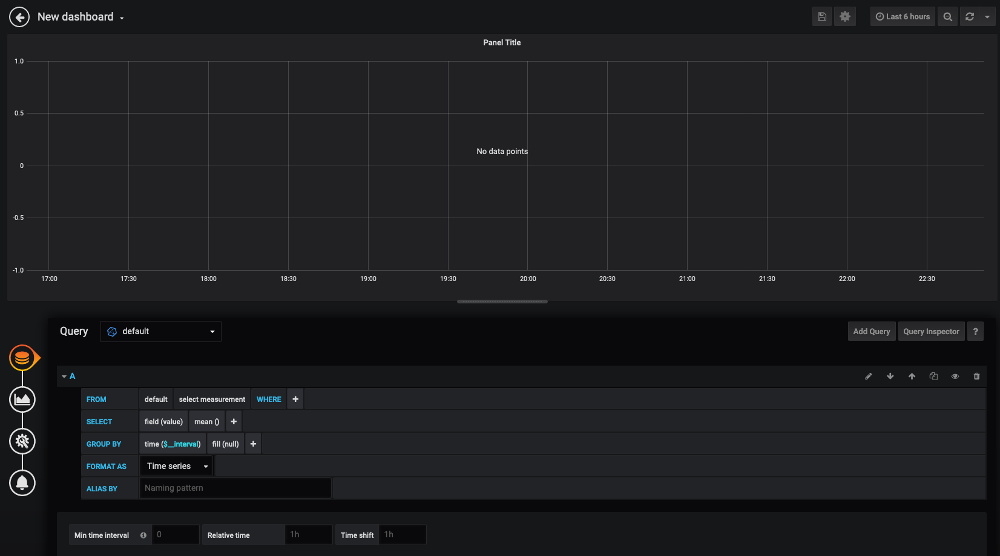

You will also want to change how far back we are looking into the database.  Let's change that range to 5 minutes.  You can do this in the top right corner of the screen:
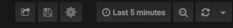

We will map out `nx1`  user and kernel CPU utilization.  We'll be adding two queries.  If you are familiar with SQL you will see similarities here.

??? example "Queries"
    


As you see they overlay each other, but what we are really looking for is mapping out totaly cpu utilization.  Click on the 2nd icon on the left to adjust the visualization.

Here we want to enable data stacking

??? example "Data Stacking"
    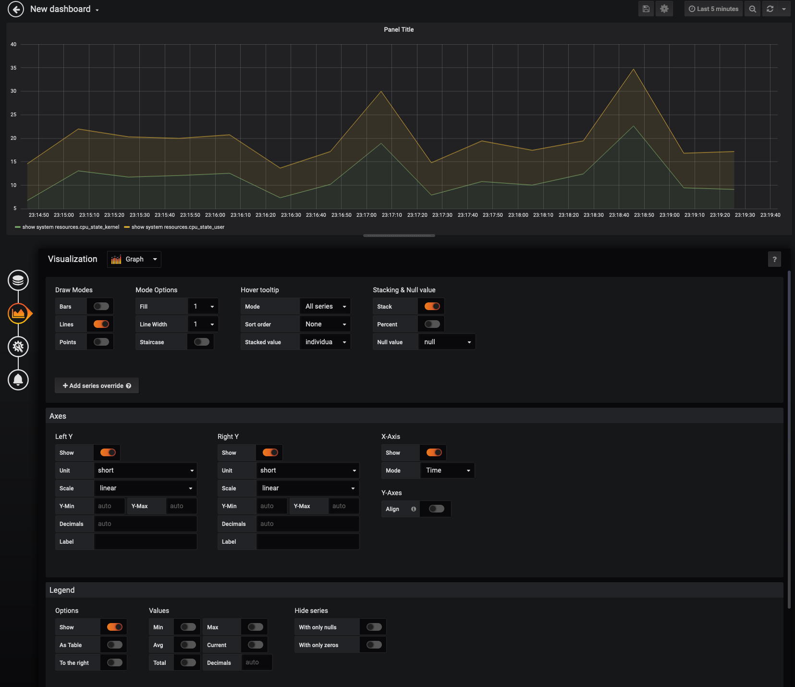

Continue to map out panels for `nx2` and `nx3` CPU utilization and arange the panels to the top of the Dashboard

??? example "CPU"
    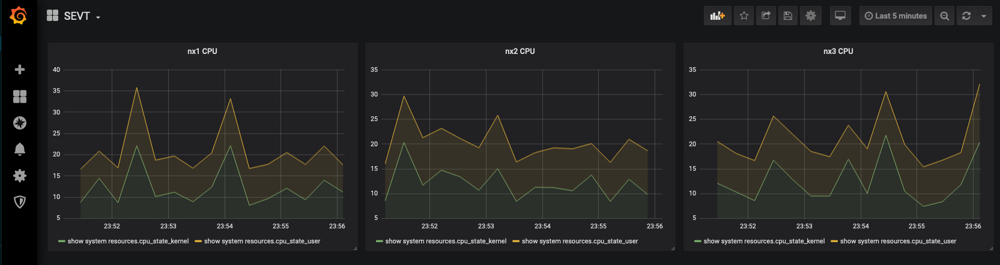


#### Free memory

Now lets track free memory across all three devices on one graph:

!!! example Query
    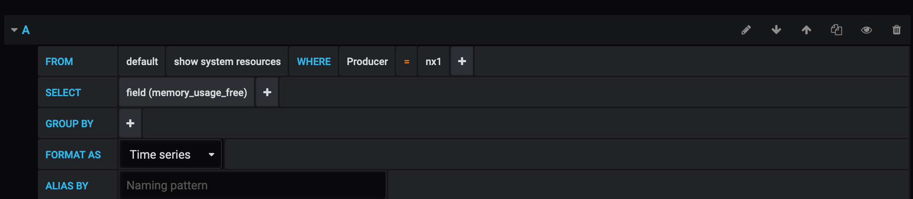

When you are done it should look like this:
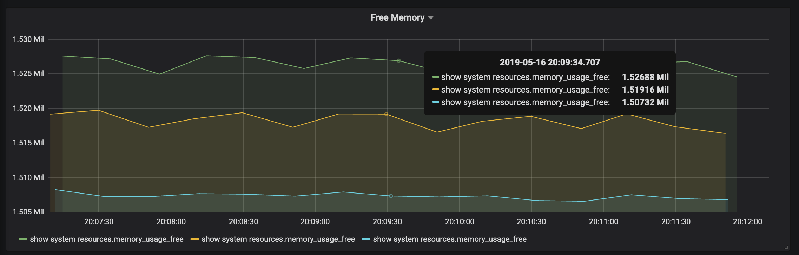


#### Challenge: Memory Utilization

Now that we have walked through a few different graphs, see if you can create a panel that looks like the following:
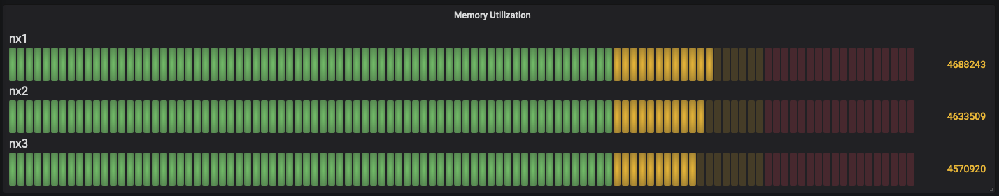

??? warning "ANSWER"
    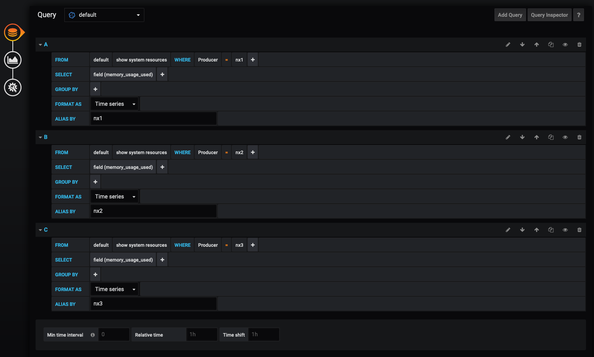
    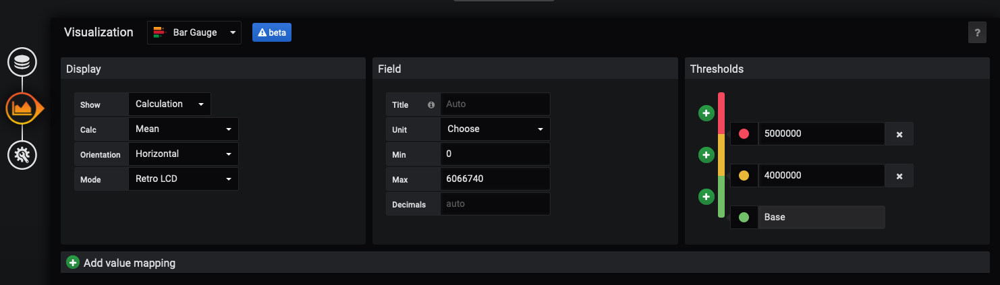


At this point you should have a dashboard like below:

??? info "Final Dashboard"
    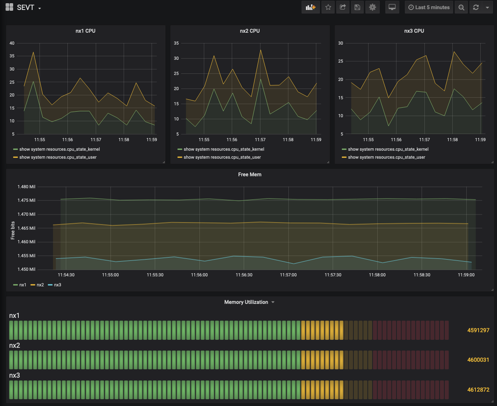

### Next steps

Feel free to continue to explore creating new or other dashboards with Grafana.  More metrics were pre-parsed.  You can add more sensors outlined in `nxos-extra-sensors`


## Lab Clean Up

Once you are done lets go ahead and clean up the lab
```
make clan
```

## More Labs

There are more telemetry based labs in DevnetSandbox, go check them out!

## Reference Material

* [Model Driven Telemetry Guide](https://www.cisco.com/c/en/us/td/docs/switches/datacenter/nexus9000/sw/7-x/programmability/guide/b_Cisco_Nexus_9000_Series_NX-OS_Programmability_Guide_7x/b_Cisco_Nexus_9000_Series_NX-OS_Programmability_Guide_7x_chapter_011000.pdf)
* [Pipeline Repo](https://github.com/cisco-ie/pipeline-gnmi)
* [Origional Pipeline](https://github.com/cisco/bigmuddy-network-telemetry-pipeline)
