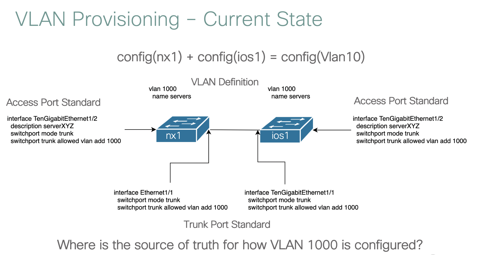

[sample-code]: https://github.com/kecorbin/nso-service-development
[commit-history]: https://github.com/kecorbin/nso-service-development/commits/master
[getting-nso]: https://developer.cisco.com/docs/nso/#!getting-nso
[installation]: https://developer.cisco.com/docs/nso/#!getting-nso/installation
# NSO with Ansible - Part Two

## Overview

The purpose of this lab guide is to walk you through setting up the environment to
test and develop this service package, or others, and how service packages can be consumed
by other tools, such as Ansible.

You can see a recording of the design and development of the code which accompanies this lab [here](https://developer.cisco.com/netdevops/live/?utm_campaign=onetdevopslive&utm_source=hank-social&utm_medium=hank-blogs#s02t06)

A development environment for NSO contains the following important components

* A local multi-vendor network simulator (netsim)
* A production grade NSO installation locally on your workstation/server of your choice.
* YANG tools including validator, compiler

For this demo, we will use a very small L2 VLAN as an example, once we've automated it, the number of devices isn't really important.



## Requirements

* an Active sandbox reservation
* [Sample Code - open  in a new tab/window][sample-code]

!!! info "DO try this at home!"

    This lab can also be ran on any Mac or Linux workstation as well, you can download
    NSO [here][getting-nso] and find installation instructions [here][installation]. Make sure you've downloaded the appropriate installer for your platform (Mac/Linux supported)

## Sample Code

This code provides a sample of codifying this topology and providing a data model, and associated API's for automating the entire lifecycle of the associated configuration.

The commit history of this repository has been curated to see each step of the process,
checkout the commit history [here][commit-hisory]

If you are working on the master branch, congratulations.  The code is done for you.  Should you want to follow along with the fun, you can use git tags/checkouts to walk you back in time.

`git checkout 1.0` will start you back at the beginning, before there was a service package.

`git checkout 2.0` at this label, we've used the `ncs-make-package` utility to generate a service package skeleton code.

```
ncs-make-package --dest packages/vlan --service-skeleton python-and-template vlan
```

Subsequent commits will show the flow of developing/tuning the service model, and then wiring in
devices via templates.


## Create NSO Development Environment

### Clone sample code

!!! info "All steps presented in this guide are written to be completed from the devbox"

Clone the repeository, and change to the projects root directory.

```
git clone https://github.com/kecorbin/nso-service-development
cd nso-service-development
```

### Create some netsim devices to work with.

Netsim is a simple tool to create and manage sets of simulated devices.  These devices aren't
real in the sense that they can forward packets, or establish routing adjacencies, but instead
the provide a management plane which can simulate the CLI/API's of a real device.

The netsim tool is great for the development phase, as we can rapidly spin up and down
instances of the simulated network, without having to procure a more robust test network/lab.
This enables the developer to iterate very quickly, and delaying the need for access
to real network environment.

A netsim device is simply an instatation of a NED, using confd to render the data model provided by the NED.


The code repository conotains a `Makefile` to make life easier (you're welcome) you should examine it's contents and understand the underlying commands the targets in this walkthrough are executing.


```
make netsim
```

??? example "Makefile `netsim` target"
    ```
    netsim:
    	ncs-netsim create-device cisco-ios ios1
    	ncs-netsim add-device cisco-nx nx1
    	ncs-netsim start
    ```

`ncs-netsim` is used to create / add devices to the simulated network, you can also rapidly
create entire groups of like devices e.g 15 IOS routers.  For our purposes, we are simply
creating a single IOS device, and a single NX-OS device.


### Create an NSO runtime

Next, we will launch our development NSO instance.  It is important that if netsim
is being used, that the nodes are created/launched prior to launching NSO. Doing so
will all the NSO setup process to detect the netsim devices, and automatically populated
into our dev instance.

You can launch the NSO instance on your devbox by running the following command.

```
make nso
```

??? example "Makefile `nso` target"
    ```
    nso:
    	ncs-setup --dest .
    	ncs
    ```
    ??? example "Makefile `netsim` target"
        ```
        # netsim targets
        netsim:
        	ncs-netsim create-device cisco-ios ios1
        	ncs-netsim add-device cisco-nx nx1
        	ncs-netsim start
        ```


### Verify development environment

You can launch a CLI session against your NSO dev instance

```
make cli

```
Verify that your NSO instance is communicating with your sims. They were automatically added when NSO was initialized and detected the presence of netsims

```
admin@ncs# show devices list
NAME  ADDRESS    DESCRIPTION  NED ID     ADMIN STATE
----------------------------------------------------
ios1  127.0.0.1  -            cisco-ios  unlocked
nx1   127.0.0.1  -            cisco-nx   unlocked

admin@ncs# devices sync-from
sync-result {
    device ios1
    result true
}
sync-result {
    device nx1
    result true
}
```

You can access the individual devices by using one of the following commands

```
ncs-netsim cli-c ios1

ncs-netsim cli-c nx1

```

You could also generate a `j-style` CLI if that's your bag.

```
ncs-netsim cli ios1

ncs-netsim cli nx1

```


Because the source of truth is the data model, these interfaces are dynamically
rendered based on users preference, or otherwise switch back and forth e.g `switch cli` from within NSO.

## Load Service Data using Ansible


#### Install Ansible

Create a python virtual environment and install Ansible
```
python3.6 -m venv venv
source venv/bin/activate
pip install ansible
```

#### Hello, Vlans!

We can now use ansible to load up / deploy some VLANs.

```
ansible-playbook load_vlans.yaml
```

??? example "Expected Output"
    ```
    (venv) [developer@devbox nso-service-development]$ansible-playbook load_vlans.yaml
    [WARNING]: Unable to parse /etc/ansible/hosts as an inventory source

    [WARNING]: No inventory was parsed, only implicit localhost is available

    [WARNING]: provided hosts list is empty, only localhost is available. Note that the implicit localhost does not match 'all'


    PLAY [Synchronization of Devices] *********************************************************************************************************

    TASK [Ensure VLANs are configured] ********************************************************************************************************
    changed: [localhost] => (item={'name': 'vlan1100', 'id': 1100, 'device': [{'device': 'ios1', 'trunk-port': [{'port': '1/1'}, {'port': '1/2'}], 'access-port': [{'port': '1/11', 'description': 'server11'}]}, {'device': 'nx1', 'trunk-port': [{'port': '1/1'}, {'port': '1/2'}], 'access-port': [{'port': '1/11', 'description': 'server11'}]}]})
    changed: [localhost] => (item={'name': 'vlan1300', 'id': 1300, 'device': [{'device': 'ios1', 'trunk-port': [{'port': '1/1'}, {'port': '1/2'}], 'access-port': [{'port': '1/13', 'description': 'server13'}]}, {'device': 'nx1', 'trunk-port': [{'port': '1/1'}, {'port': '1/2'}], 'access-port': [{'port': '1/13', 'description': 'server13'}]}]})

    PLAY RECAP ************************************************************************************************************************** ******
    localhost                  : ok=1    changed=1    unreachable=0    failed=0
    ```

Review the contents of the playbook. Notice the YAML structure of the service instance (vlan) data, we will
now view this same data from a few other NSO northbound interfaces.

??? example "load_vlans.yaml playbook"
    ```
    ---

    - name: Synchronization of Devices
      hosts: localhost
      connection: local
      gather_facts: no

      tasks:

        - name: Ensure VLANs are configured
          with_items:
            - name: vlan1100
              id: 1100
              device:
                - device: ios1
                  trunk-port:
                    - port: 1/1
                    - port: 1/2
                  access-port:
                    - port: 1/11
                      description: server11
                - device: nx1
                  trunk-port:
                    - port: 1/1
                    - port: 1/2
                  access-port:
                    - port: 1/11
                      description: server11
            - name: vlan1300
              id: 1300
              device:
                - device: ios1
                  trunk-port:
                    - port: 1/1
                    - port: 1/2
                  access-port:
                    - port: 1/13
                      description: server13
                - device: nx1
                  trunk-port:
                    - port: 1/1
                    - port: 1/2
                  access-port:
                    - port: 1/13
                      description: server13

          nso_config:
            url: http://localhost:8080/jsonrpc
            username: "admin"
            password: "admin"
            data:
              netdevops:vlan:
                - "{{ item }}"
    ```

#### Verify, Vlans!
We can also verify that our netsim devices received the proper device level configuration.

```
ncs-netsim cli-c nx1
show running-config vlan
show running-config interface Ethernet1/13
```

??? example "Expected Output"
    ```
    nx1#show running-config vlan
    vlan 1,380,400
    !
    vlan 1100
     name vlan1100
    !
    vlan 1300
     name vlan1300
    !
    nx1#show running-config interface Ethernet 1/13
    interface Ethernet1/13
     no shutdown
     description server13
     switchport access vlan 1300
     spanning-tree port type edge
    exit
    nx1#
    ```
## Explore Northbound Interfaces

The service data (or any other piece of NSO/device configuration) can also be created,
read, updated, or deleted (CRUD) from any number of northbound interfaces.


REST(JSON)
```
curl -u admin:admin -H "Accept: application/vnd.yang.collection+json" http://localhost:8080/api/running/vlan
```

REST(XML)
```
curl -u admin:admin -H "Accept: application/vnd.yang.collection+xml" http://localhost:8080/api/running/vlan
```

WebUI

A WebUI for the service model is also rendered. [open in new tab](http://10.10.20.20:8080/webui-one/ConfigurationEditor/netdevops:vlan)

CLI

Network Engineers might prefer a familiar CLI interface.

```
ncs_cli -u admin -C
show running-config vlan
```

??? example "Expected Output"
    ```
    (venv) [developer@devbox nso-service-development]$ncs_cli -u admin -C

    admin connected from 192.168.42.1 using ssh on devbox
    admin@ncs# show running-config vlan
    vlan vlan1100
     id 1100
     device ios1
      trunk-port 1/1
      !
      trunk-port 1/2
      !
      access-port 1/11
       description server11
      !
     !
     device nx1
      trunk-port 1/1
      !
      trunk-port 1/2
      !
      access-port 1/11
       description server11
      !
     !
    !
    vlan vlan1300
     id 1300
     device ios1
      trunk-port 1/1
      !
      trunk-port 1/2
      !
      access-port 1/13
       description server13
      !
     !
     device nx1
      trunk-port 1/1
      !
      trunk-port 1/2
      !
      access-port 1/13
       description server13
      !
     !
    !
    ```
You can also quickly generate payloads for other interfaces.  For example, imagine
a networking engineer needed to hand of a REST API payload to a Service Now developer,
they could run the following.

```
show running-config vlan | display json
```

??? example "Expected Output"

    ```
    admin@ncs# show running-config vlan | display json
    {
      "data": {
        "netdevops:vlan": [
          {
            "name": "vlan1100",
            "id": 1100,
            "device": [
              {
                "device": "ios1",
                "trunk-port": [
                  {
                    "port": "1/1"
                  },
                  {
                    "port": "1/2"
                  }
                ],
                "access-port": [
                  {
                    "port": "1/11",
                    "description": "server11"
                  }
                ]
              },
              {
                "device": "nx1",
                "trunk-port": [
                  {
                    "port": "1/1"
                  },
                  {
                    "port": "1/2"
                  }
                ],
                "access-port": [
                  {
                    "port": "1/11",
                    "description": "server11"
                  }
                ]
              }
            ]
          },
          {
            "name": "vlan1300",
            "id": 1300,
            "device": [
              {
                "device": "ios1",
                "trunk-port": [
                  {
                    "port": "1/1"
                  },
                  {
                    "port": "1/2"
                  }
                ],
                "access-port": [
                  {
                    "port": "1/13",
                    "description": "server13"
                  }
                ]
              },
              {
                "device": "nx1",
                "trunk-port": [
                  {
                    "port": "1/1"
                  },
                  {
                    "port": "1/2"
                  }
                ],
                "access-port": [
                  {
                    "port": "1/13",
                    "description": "server13"
                  }
                ]
              }
            ]
          }
        ]
      }
    }
    ```


## Cleanup

You can start over at anytime, it's just a development environment.

```
make clean
```


## Key Takeaways

NSO provides a very nice development environment including a multi-vendor network simulator,
a local production grade NSO installation, as well as utilities for generating boilerplate
code to get started developing quickly.

Ansible playbooks can be used in conjunction with NSO to quickly manipulate CDB data
to provision service or device configuration.

Other consumers of these network services have a choice of northbound interfaces including
NetConf/RESTConf/REST/CLI/WebUI.

The two working in conjunction provide a seperation of concerns between the desired state
(represented in playbook) and the required changes to reach that configuration (represented in NSO service definition)
