# In the Know with Telemetry


!!! bug "TODO"
    * [ ] Add prebuilt dashboard json examples
    * [ ] Add in section of Grafana to import dashboards
    * [ ] Chnage name from metrics-pig-nx to "visualization nxos telemetry with grafana" metrics-grafana
    * [ ] Build a makefile for make clean and make lab

A few notes about the lab guide:

???+ example "Output"
    This type of box is meant to describe output you will see if you run the commands given to you, useful if you are just reading the lab guide, or want to verify what you are seeing.

???+ info "Info"
    This type of box is meant to represent file or config data

## Overview

Collecting data for analyzing and troubleshooting has always been an important aspect in monitoring the health of a network. Cisco NX-OS provides several mechanisms such as SNMP, CLI, and Syslog to collect data from a network.  These mechanisms have limitations that restrict automation and scale.  One limitation is the use of the pull model, where the initial request for data from network elements originates from the client.  The pull model does not scale when there is more than one network management station(NMS) in the network.  With this model, the server sends data only when clients request it. To initiate such requests, continual manual intervention is required.  This continual manual intervention makes the pull model inefficient. A push model continuously streams data out of the network and notifies the client.  Telemetry enables the push model, which provides near-real-time access to monitoring data.

In this lab we will review the components needed to collect this pushed data using an example open-source telemetry stack.

In our examples we will have some pre-built components due to time restrictions, but you can see how these fit into the puzzle and links will bring you to further instructions on how to add to them yourself.


!!! bug "TODO"
    Get picture of topology

In this lab we will be using the topology shown above.  It is a simple 3 NX-OS topology hosted in VIRL.  We will also be using Devbox in the DevNetSandbox to run our telemetry stack.

## Prepare the lab and Start the Simulation
Before we begin the lab we need to download the correct git repo and start the VIRL simulation.

In this lab we will be using [virlutils](http://github.com/ciscodevnet/virlutils) to manage VIRL from Devbox.

```
#(password - C1sco12345)
ssh developer@10.10.20.20
git clone https://github.com/DevNetSandbox/sbx_multi_ios/
cd sbx_multi_ios
cd metrics-pig-nx
virl up
```

It will take a few minutes to spin up the switches.  We can monitor the progress by running `virl nodes`

??? example "virl nodes"
    ```
    [developer@devbox metrics-pig-nx]$virl nodes
    Here is a list of all the running nodes
    ╒════════╤═════════════╤═════════╤═════════════╤════════════╤══════════════════════╤════════════════════╕
    │ Node   │ Type        │ State   │ Reachable   │ Protocol   │ Management Address   │ External Address   │
    ╞════════╪═════════════╪═════════╪═════════════╪════════════╪══════════════════════╪════════════════════╡
    │ nx1    │ NX-OSv 9000 │ ACTIVE  │ REACHABLE   │ telnet     │ 172.16.30.65         │ N/A                │
    ├────────┼─────────────┼─────────┼─────────────┼────────────┼──────────────────────┼────────────────────┤
    │ nx2    │ NX-OSv 9000 │ ACTIVE  │ REACHABLE   │ telnet     │ 172.16.30.66         │ N/A                │
    ├────────┼─────────────┼─────────┼─────────────┼────────────┼──────────────────────┼────────────────────┤
    │ nx3    │ NX-OSv 9000 │ ACTIVE  │ REACHABLE   │ telnet     │ 172.16.30.67         │ N/A                │
    ╘════════╧═════════════╧═════════╧═════════════╧════════════╧══════════════════════╧════════════════════╛
    ```

We will also want to go ahead and spin up our telemetry stack:
```
cd telemetry-stack
docker-compose up -d
```

You can see the containers that get spun up, and what ports they are listening on by running `docker-compose ps`
??? example "docker-compose ps"
    ```
    [developer@devbox telemetry-stack]$docker-compose ps
                  Name                             Command               State                       Ports
    ---------------------------------------------------------------------------------------------------------------------------
    telemetrystack_elasticsearch_1      /usr/local/bin/docker-entr ...   Up      0.0.0.0:9200->9200/tcp, 0.0.0.0:9300->9300/tcp
    telemetrystack_grafana_1            /run.sh                          Up      0.0.0.0:3000->3000/tcp
    telemetrystack_influxdb_1           /entrypoint.sh influxd           Up      0.0.0.0:8083->8083/tcp, 0.0.0.0:8086->8086/tcp
    telemetrystack_prometheus_1         /bin/prometheus -config.fi ...   Up      0.0.0.0:9090->9090/tcp
    telemetrystack_unified-pipeline_1   /bin/sh -c ./startup.sh          Up      0.0.0.0:57500->57500/tcp
    ```


## Telemetry Components Overview
There are four major components of telemetry we need to outline before we get started.

### Data Collection
Telemetry data is collected from a few possible sources:

1. Data Management Engine (DME) - This data can be collected periodically or only when a change is made to the specified path
2. NX-API - This data can be collected periodically
3. YANG

### Data Encoding
The telemetry encoder encapsulates the collected data into the desired format.  For NXOS we have the following options:
1. Google Protocol Buffers (GPB) - [ More info on GPB](https://developers.google.com/protocol-buffers/docs/overview)
2. JSON

At the end of the day, you will decide which encoding you will use based upon the receiver's capabilities

### Data Transport
NXOS allows you to transport JSON encoded data via HTTP/HTTPS and GPB encoded data via Google remote procedure call (gRPC).  Both JSON and GPB can also be transported via UDP.

### Telemetry Receiver
The telemetry receiver is a remote system that ingests and stores the telemetry data.  We will expand upon our telemetry stack further in a bit.

!!! bug "TODO"
    Outline telemetry stack

## Nexus Telemetry Setup
To begin we need to setup telemetry collection on our Nexus devices.

We have created sample configuration to get you started that is already setup for parsing my our telemetry receiver (Pipeline). The data parsing can be tricky and requires rebuilds of the Pipeline container, so it will not be addressed in this lab.

You can find the NXOS config in `sample-nxos-config.txt`
!!! bug "TODO"
    Add `sample-nxos-config.txt` to an example here

In our example we have setup 2 sensor groups and 1 destination group:

* destination-group 100 - This group points to Devbox port 57500 where our telemetry receiver is listening.  We are transporting data encoded in GPB over gRPC
* sensor-group 100 - This group uses the DME
* sensor-group 200 - This group uses NX-API


## Pipeline Overview
[Pipeline](https://github.com/cisco/bigmuddy-network-telemetry-pipeline) is an open source telemetry receiver for IOS XR and NXOS.

Pipeline supports many different input transports including:
* TCP
* gRPC
* UDP
* Apache Kafka

It also supports the following encoding:
* st
* GPB, both Compact and K/V
* JSON

From an output perspective Pipeline supports Apache Kafka, gRPC, but most importantly in our stack Metrics Extraction.  This allows us to connect pipeline to a Time Series Database (TSDB), in this case InfluxDB.  We can then layer on other visualization tools to view the data, like Grafana.

The 3 main components of Pipeline are:
* pipeline.bin - Pipeline's binary
* pipeline.conf - inbound and outbound config for pipeline
* metrics.json - parser for data

Take a look at your `sbx_multi_ios/metrics-pig-nx/telemetry-stack/unified-pipeline/config/pipeline.conf`
!!! info "pipeline.conf"
    ```
    [default]

    id = unified-pipeline


    [gRPCDialout]
    stage = xport_input
    type = grpc
    encap = gpb
    listen = :57500

    datachanneldepth = 1000

    [inspector]
    stage=xport_output
    type=tap
    file=telemetry_model_raw.txt


    [influxdb]
    stage = xport_output
    type = metrics
    file = /etc/pipeline/metrics_gpb.json
    dump = metricsdump.txt
    username=cisco
    password=VXJIodGD1ABLKJYg1Xcsdj6goVgezhtVX44zIO9ha1pPOK09WyfeTq+7HdJ8gKdgxPcXxsbuiZsQ0JYJ8KFcMHPdjy/V5F76Wc9qwm7f6+NeFca7XaiTIr1t4rwOG5cHDWooPW023v2cpiLIjQjpoeam/xyBJTKFuyPvi3/CgokXn5Hx3GCZqx1UDdikcSrh8xh3yXVkNzzSk8g2RwiBTdrlbrFEWBe1rW8SF4hapWvjZ22asvxOLF6YB6i2XUyggnHF4+oB4DLY7mqlfWUU2gibqMqCfsmZBwCnRww2+4Y1r1qZyAstd4a2orSDCtPN7sw6HyeAd6tKIj1F9UOwQWgDBnkQBGAH1Gdq9iCTF6Q/gMgN5F+g4FU9dGXQYcUw0BmlNYtRiR74ecAgDLdZ5mijIuJmaFyEdo+bIuHdXSIhc875TjoP23AnpbSA95tWsuwc7gtB0Sx165NDZwJWOOPVlNUQ4XV/PcOF+atO7GVnvfC1jcd+Ds2W9pPVWIlIbboWIjSp+vGww9lB8AWIbqFxxoM7NRJJyfzqNLJemW7De7EmuBU5rFRvYIjZi1+5x+jpERFi5Hry+YtrDWmpXBjqVi6K0InSXMk7NMVC8JByZF7V8CmheH/lIx9w9mwHnYWpwsqvPl1HTcjr4R4kuGPio5RGk88QuovjsgwIRD0=
    output = influx
    influx = http://influxdb:8086
    database = netdevops
    ```

The key compoents here is the `[gRPCDialout]` and `[influxdb]`.  The `[inspector]` is a tap that allows us to dump the inbound telemetry data to a file to allow us to see what is being sent, so we can setup our parser in the `metrics.json` file.


Look at the `sbx_multi_ios/metrics-pig-nx/telemetry-stack/unified-pipeline/config/metrics.json` file.
??? info "metrics.json"
    ```
    [
    	{
    		"basepath": "Cisco-NX-OS-device:System/ospf-items/operSt",
    		"spec": {
    			"fields": [
    				{"name": "Cisco-NX-OS-device:System/ospf-items/operSt", "tag": true},
    				{
    					"name": "",
    				  "fields":
    						[
    							{"name": "operSt"}
    						]
    				}
    			]
    		}
    	},
    	{
    		"basepath": "show system resources",
    		"spec": {
    			"fields": [
    				{"name": "show system resources", "tag": true},
    				{
    					"name": "",
    					"fields":
    						[
    							{"name": "cpu_state_user"},
    							{"name": "cpu_state_kernel"},
    							{"name": "cpu_state_idle"},
    							{"name": "memory_usage_free"},
    							{"name": "memory_usage_total"},
    							{"name": "memory_usage_total"}
    						]
    				}
    			]
    		}
    	},
      ...
      ...
      ...
      ]
    ```

Lets take a look at an NX-API parsing example: `show system resources`.

The raw data looks like below.  You can get this info by looking at the telemetry_model_raw.txt file running in the `unified-pipeline` container .

!!! bug "TODO"
    do a docker exec command

!!! info "show system resources telemetry"
    ```
    ------- 2019-05-09 20:17:51.031108675 +0000 UTC m=+175.717736295 -------
    Summary: GPB(common) Message [172.16.30.65:23370(nx1)/show system resources msg len: 575]
    {
        "Source": "172.16.30.65:23370",
        "Telemetry": {
            "node_id_str": "nx1",
            "subscription_id_str": "200",
            "encoding_path": "show system resources",
            "collection_id": 1012,
            "collection_start_time": 0,
            "msg_timestamp": 1557433070928,
            "collection_end_time": 0
        },
        "Rows": [
            {
                "Timestamp": 0,
                "Keys": {
                    "show system resources": "show system resources"
                },
                "Content": {
                    "": {
                        "TABLE_cpu_usage": {
                            "": {
                                "ROW_cpu_usage": {
                                    "_PIPELINE_EDIT": [
                                        {
                                            "cpuid": 0,
                                            "idle": "71.13",
                                            "kernel": "13.40",
                                            "user": "15.46"
                                        },
                                        {
                                            "cpuid": 1,
                                            "idle": "83.51",
                                            "kernel": "16.48",
                                            "user": "0.00"
                                        }
                                    ]
                                }
                            }
                        },
                        "cpu_state_idle": "77.12",
                        "cpu_state_kernel": "14.89",
                        "cpu_state_user": "7.97",
                        "current_memory_status": "OK",
                        "load_avg_15min": "0.62",
                        "load_avg_1min": "0.75",
                        "load_avg_5min": "0.64",
                        "memory_usage_free": 1552392,
                        "memory_usage_total": 6066740,
                        "memory_usage_used": 4514348,
                        "processes_running": 1,
                        "processes_total": 689
                    }
                }
            }
        ]
    }
    ```

We can build our metrics.json file to parse this data to collect the fields we are interested in:

!!! info "example parser"
    ```
    {
      "basepath": "show system resources",
      "spec": {
        "fields": [
          {"name": "show system resources", "tag": true},
          {
            "name": "",
            "fields":
              [
                {"name": "cpu_state_user"},
                {"name": "cpu_state_kernel"},
                {"name": "cpu_state_idle"},
                {"name": "memory_usage_free"},
                {"name": "memory_usage_total"},
                {"name": "memory_usage_total"}
              ]
          }
        ]
      }
    },
    ```

You can see how we called out the fields we care out.  These will be sent to InfluxDB.

## InfluxDB
[InfluxDB](https://www.influxdata.com/) is an open source Time Series DB (TSDB) that we will be leveraging to store the telemetry data we are sending to Pipeline.  A TSDB is optimized around handling arrays of numbers indexed by time.

While we don't need to be InfluxDB experts to leverage it, its good to know how to check and validate your data is there.

Influx does have a web interface that you can reach at [http://10.10.20.20:8083](http://10.10.20.20:8083) but we'll just be using CURL for these examples.

First lets make sure our database got created.  We are looking for one called `netdevops`
```
curl http://10.10.20.20:8086/query?q=SHOW+DATABASES
```

??? example "Output"
    ```
    [developer@devbox telemetry-stack]$curl http://10.10.20.20:8086/query?q=SHOW+DATABASES
    {"results":[{"series":[{"name":"databases","columns":["name"],"values":[["netdevops"],["_internal"]]}]}]}
    ```

Hopefully you see what you are looking for in the output.  That confirms InfluxDB is setup as we need it, now lets see if we are recieving data from the switches:
```
curl -G 'http://localhost:8086/query?pretty=true' --data-urlencode "db=netdevops" --data-urlencode "q=SHOW MEASUREMENTS"
```

??? example "Output"
    ```
    [developer@devbox telemetry-stack]$curl -G 'http://localhost:8086/query?pretty=true' --data-urlencode "db=netdevops" --data-urlencode "q=SHOW MEASUREMENTS"
    {
        "results": [
            {
                "series": [
                    {
                        "name": "measurements",
                        "columns": [
                            "name"
                        ],
                        "values": [
                            [
                                "show system resources"
                            ]
                        ]
                    }
                ]
            }
        ]
    }
    ```

At this point we can see we have measurements inside our database.  If you are interested in digging into them you can find the API guide for InfluxDB [here](https://docs.influxdata.com/influxdb/v1.7/guides/querying_data/).

## Grafana
Grafana is an open source general purpose dashboard and graph composer.  We can leverage it to graph the telemetry data we are storing in Grafana.

Access Grafana by pointing your browser to `http://10.10.20.20:3000`.

### Setup
We first need to setup Grafana to read data from InfluxDB.  Log into Grafana using the username: `admin` and password: `admin`.  You can find the login icon at the bottom left of the screen.

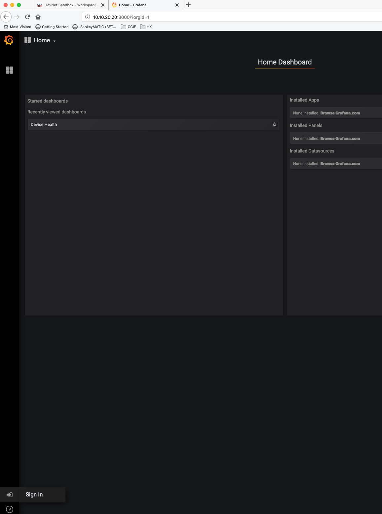

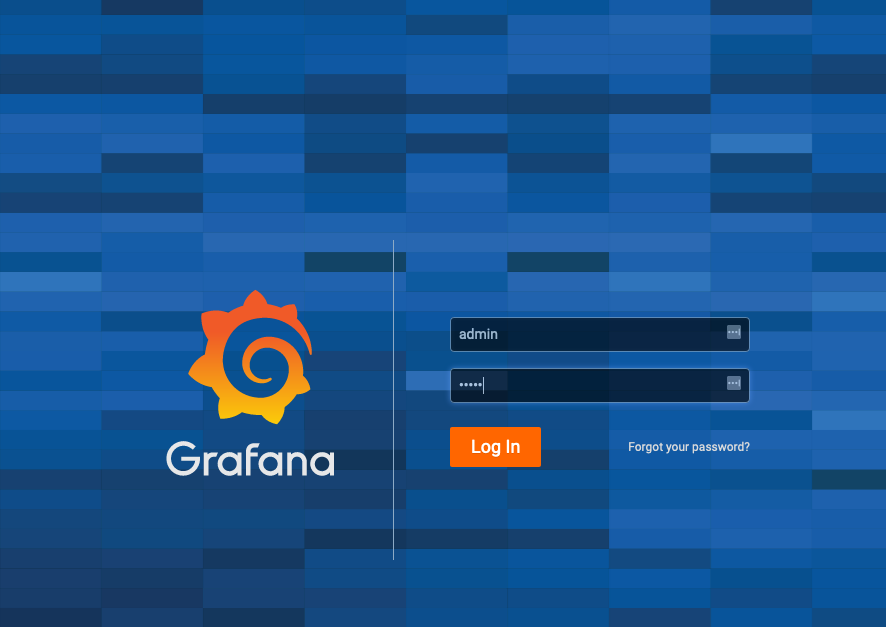

!!! note
    Grafana may ask you to change the admin password, you can safely skip this step.

After you login, you will be broght to your Home Dashboard.  Click `Create your first data source`
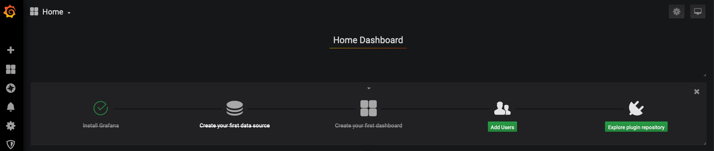

Select InfluxDB
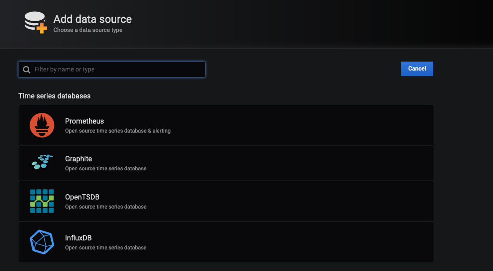

Set the following:

| field | value |
| --- | --- |
| URL | http://influx:8086 |
| Database | netdevops |
| User | cisco |
| Password | cisco |

Once you fill out the fields click the test button at the bottom.

Now that we have connected Grafana to InfluxDB we can begin to visualize the data.

### Build our First Dashboard

#### CPU Utilization

Let's build a dashboard.  Click `Create your first Dashboard`


!!! bug "TODO"
    Add screenshot

Click `Add Query`

Here we can see a live graph that will map the data we are going to query over time.
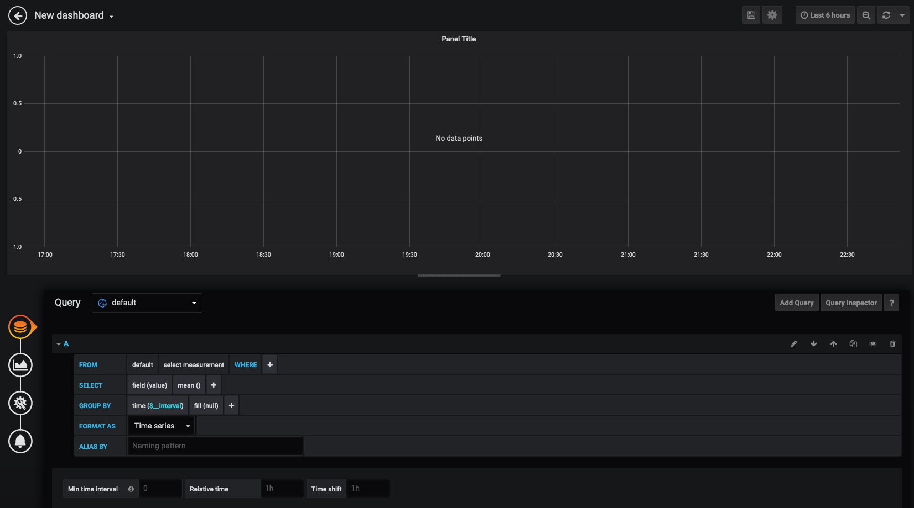

We will map out `nx1`  user and kernel CPU utilization.  We'll be adding two queries.  If you are familiar with SQL you will see similarities here.

??? example "Queries"
    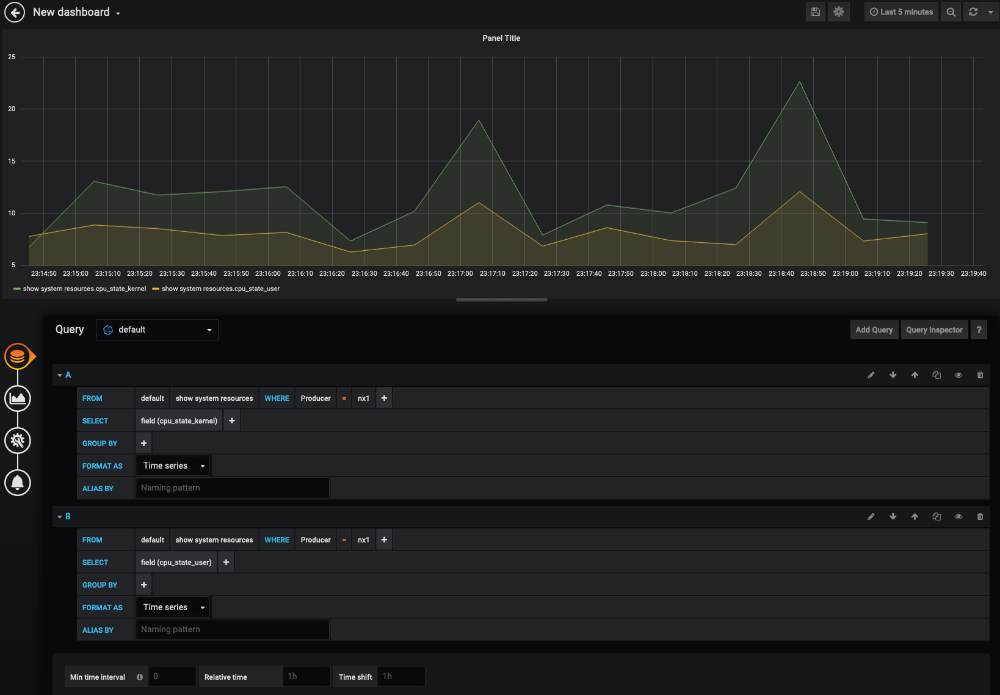


As you see they overlay each other, but what we are really looking for is mapping out totaly cpu utilization.  Click on the 2nd icon on the left to adjust the visualization.

Here we want to enable data stacking

??? example "Data Stacking"
    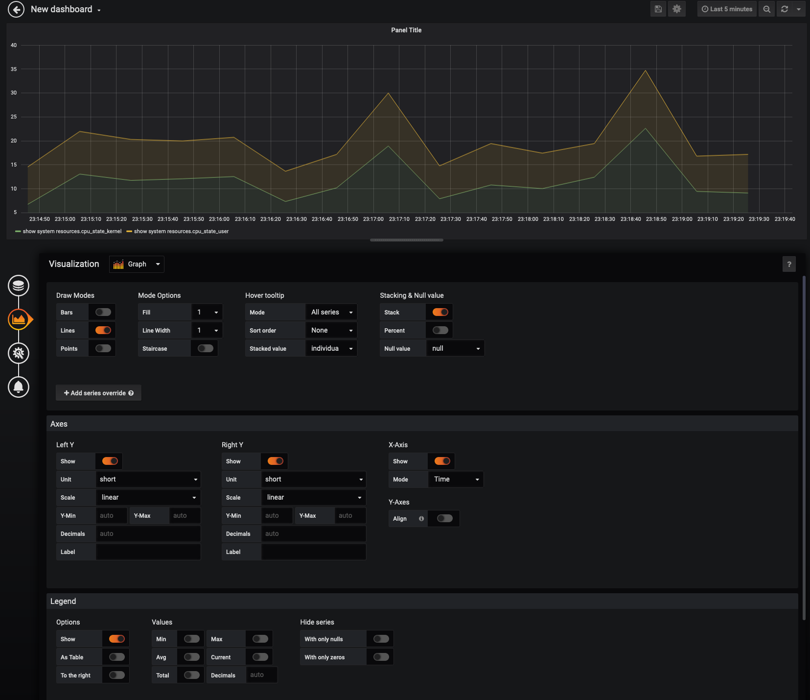

Continue to map out panels for `nx2` and `nx3` CPU utilization and arange the panels to the top of the Dashboard

??? example "CPU"
    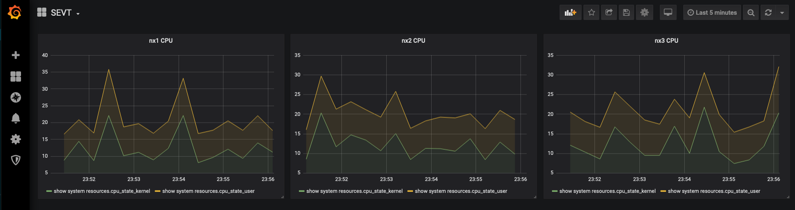


#### Free memory

!!! bug "TODO"
    Add in Free memory steps

#### Challenge: Memory Utilization

Now that we have walked through a few different graphs, see if you can create a panel that looks like the following:
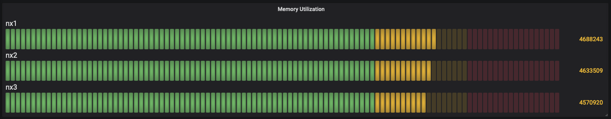

??? warning "ANSWER"
    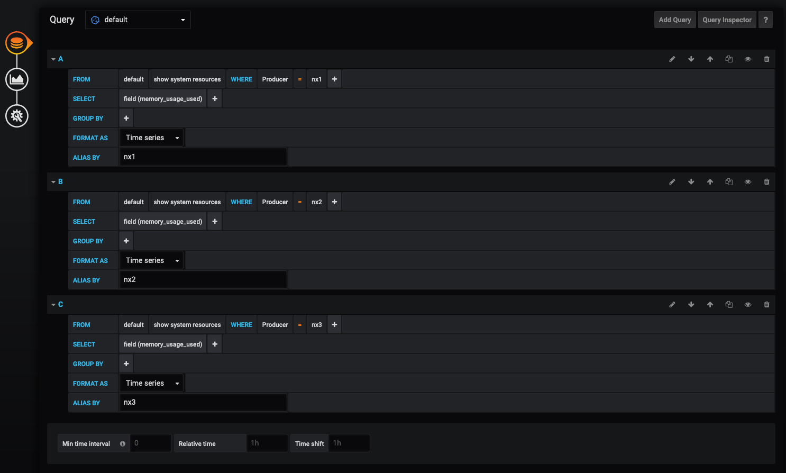
    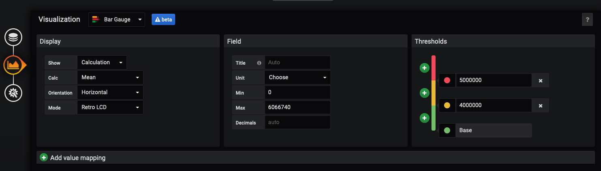


At this point you should have a dashboard like below:

!!! bug "TODO"
    Add in complete daashboard

### Next steps

Feel free to continue to explore creating new or other dashboards with Grafana.  More metrics were pre-parsed.  You can add more sensors outlined in `nxos-extra-sensors`

!!! bug "TODO"
    Create more sensors

!!! bug "TODO"
    Outline importing dashboards


## Lab Clean Up

!!! bug "TODO"
    Outline how to clean up the lab

## Reference Material

* [Model Driven Telemetry Guide](https://www.cisco.com/c/en/us/td/docs/switches/datacenter/nexus9000/sw/7-x/programmability/guide/b_Cisco_Nexus_9000_Series_NX-OS_Programmability_Guide_7x/b_Cisco_Nexus_9000_Series_NX-OS_Programmability_Guide_7x_chapter_011000.pdf)
* [Pipeline Repo](https://github.com/cisco-ie/pipeline-gnmi)
* [Origional Pipeline](https://github.com/cisco/bigmuddy-network-telemetry-pipeline)
