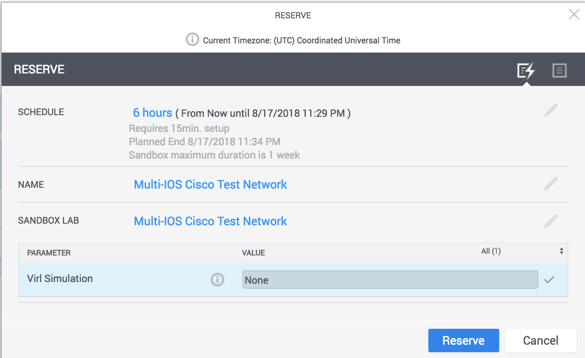

# Sandbox Setup

## Overview

As these labs use a common Cisco Devnet Sandbox, all labs will need to be prepped to begin.

## Reserve a sandbox lab

You can reserve a sandbox lab [here](https://devnetsandbox.cisco.com/RM/Diagram/Index/6b023525-4e7f-4755-81ae-05ac500d464a?diagramType=Topology). During the reservation, you can select "None" for
simulation, as we will be launching the required topologies as part of the setup.

It takes about 15 minutes to spin up the VIRL servers and your devbox.  Hang tight and do some emails.




## Setup

Here's a video overview of the process... from here feel free to press fast forward in the middle...

!!! bug "TODO"
    Re-record of just the setup process

[](https://asciinema.org/a/5OZEo29CwO2PiWhV7T1nW1QgF)


## Detailed instructions

### Step 1. Connect to devbox

After your reservation is complete you will receive and email with credential to
connect to the sandbox via VPN.  Once connected you can ssh to the devbox using the following credentials: `developer/C1sco12345`

    ssh developer@10.10.20.20

### Step 2: Clone this repository

```
git clone --recurse-submodules https://github.com/DevNetSandbox/sbx_multi_ios.git
```

### Step 3: Choose a Lab

At this point your devbox is ready to go.  Each folder in the repo you downloaded contains its own code.  These are meant to reusable across multiple walkthroughs, or to just get you started.

For a full curated lab look at the documentation to the left.  You will see lab guides that have detailed instructions.
