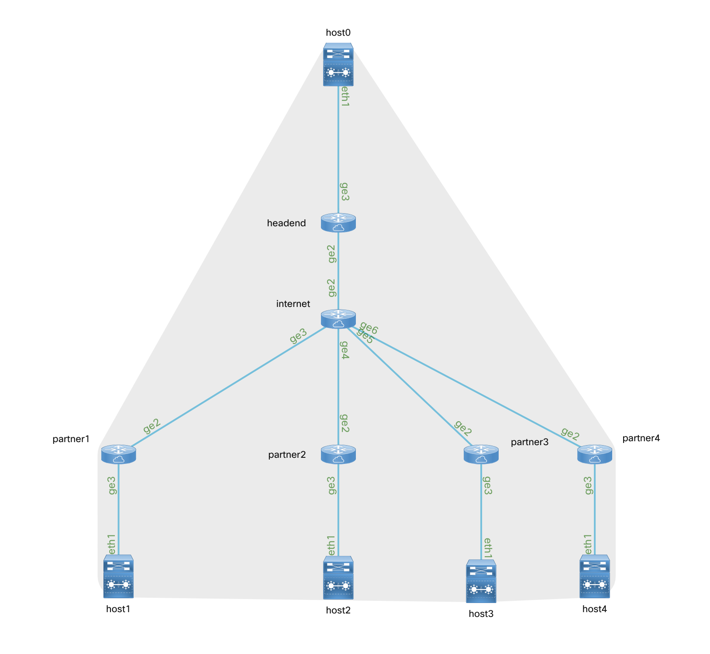

# HEMP

This is a proof of concept VPN **H**ead **E**nd **M**anagement **P**latform.

The primary use case is managing an extranet environment where partner VPN connections are terminated on the `headend` device, while the remote side of the VPN connection is managed by a 3rd party.

This proof of concept is designed to be basic demonstration of a VPN service package for Cisco Network Services Orchestrator (NSO) as well as an example of integrating NSO with custom portals using it's northbound API interfaces.


This proof of concept is designed to be ran in the [Multi-IOS Cisco Test Network Sandbox](https://devnetsandbox.cisco.com/RM/Diagram/Index/6b023525-4e7f-4755-81ae-05ac500d464a?diagramType=Topology) you can reserve one today for free!

### Topology

This proof of concept provides the following topology running on Cisco VIRL.



## Portal Architecture

The management portal uses the following technologies to
* Python/Flask/JavaScript for the primary web interface
* Telegraf, InfluxDB, and Grafana for visualizing operational metrics which are collected via SNMP.
* For ease of deployment and portability, all of the above components are ran as a [docker compose stack](./docker-compose.yaml) which can be ran directly on the devbox in your sandbox.

## NSO Service Model

The primary service model for NSO can be found at [./nso/packages/vpn](./nso/packages/vpn) Service models/packages are the primary way that NSO functionality is extended.  A service model is comprised of a YANG file, a set of templates, and optionally some python or java logic.

# Quickstart

##### VPN into Sandbox

VPN credentials and gateways are emailed to you once your sandbox is ready.

##### Connect to Devbox
While VPN'd into the sandbox. SSH into the  devbox

```
ssh developer@10.10.20.50
```
The
default credentials are `developer/C1sco12345`

##### Clone the repository
```
git clone https://github.com/DevNetSandbox/sbx_multi_ios.git
cd sbx_multi_ios/hemp
```

##### Run Setup script

This following script should cover all the initial installation

```
./setup.sh
```

Once the process is complete, HEMP should be accessible at http://10.10.20.50:5001

## Environment Overview


The topology contains a `headend` device where partner extranet VPN connections are terminated.  

The topology contains four routers `partner1`, `partner2`, `partner3` and `partner4` These devices represent the "unmanaged" side of an extranet/partner VPN connection.  portal to configure the headends appropriately. These devices are also configured with IP SLA probes to keep interesting VPN traffic flowing.

* `partner1` and `partner2` have been preconfigured using Ansible and associated NSO modules to configure the corresponding headend configuration.
* `partner3` and `partner4` are preconfigured on the partner side but will need to be added on the headends via the management portal given the following parameters.

  ```
  partner3:
    - partner_name: partner3
      device:
        - headend
      sequence: 103
      peer_ip: 172.16.252.3
      isakmp_algo: 3des
      isakmp_group: 2
      pre_shared_key: cisco
      transform_encryption: esp-3des
      transform_auth: esp-md5-hmac
      acl_number: "101"
      acl_rule: "permit ip 192.168.0.0 0.0.0.255 192.168.3.0 0.0.0.255"

  partner4:
    - partner_name: partner4
      device:
        - headend
      sequence: 104
      peer_ip: 172.16.252.4
      isakmp_algo: 3des
      isakmp_group: 2
      pre_shared_key: cisco
      transform_encryption: esp-3des
      transform_auth: esp-md5-hmac
      acl_number: "104"
      acl_rule: "permit ip 192.168.0.0 0.0.0.255 192.168.4.0 0.0.0.255"

  ```

### Additional Notes / Credentials

* The NSO instance running on the devbox uses credentials `admin`/`admin` you can access it by running `ncs_cli -u admin` from the devbox
* The default grafana credentials are `admin`/`admin` as well, you will be prompted to change this the first time you access the dashboards.
* If you want to tinker with the Grafana instance it is accessible at http://10.10.20.50:3000


### Known Issues

* If you boot up the environment multiple times, subsequence instances may have problems properly displaying the Grafana iframes.  If you encounter this issue, clear your browsers cache and reload the page.
