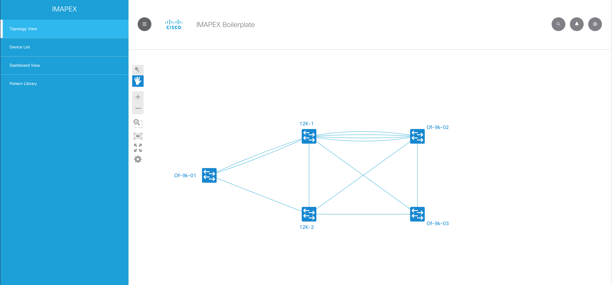

# boilerplate - Hello World

Any applicable badges (build/documentation/collaboration/licenses should go here

# Description

Boilerplate is a starting point application for the IMAPEX team @ Cisco.

This boilerplate contains the following

* Flask
* Flask-Restful
* Cisco UI toolkit
* NextUI for drawing network toplogies
* Bootstrap
* Samples for common use cases

# Screenshots

Display Network Topologies

Create custom dashboards

Manage devices

Customize using Cisco UI Kit

# Installation

## Environment

Prerequisites

* Python 2.7+
* [setuptools package](https://pypi.python.org/pypi/setuptools)

## Downloading

Provide instructions for how to obtain the software from this repository, if there are multiple options - please include
as many as possible

Option A:

If you have git installed, clone the repository

    git clone https://github.com/imapex/boilerplate

Option B:

If you don't have git, [download a zip copy of the repository](https://github.com/imapex/boilerplate/archive/master.zip)
and extract.

Option C:

The latest build of this project is also available as a Docker image from Docker Hub

    docker pull username/image:tag

## Installing

Provide instructions on how to install / use the application

# Usage

Provide any relevant code samples / CLI's to leverage the code

    python app.py

# Development

Provide any notes for other contributors.  This includes how to run tests / etc

## Linting

We use flake 8 to lint our code. Please keep the repository clean by running:

    flake8

## Testing

The IMAPEX team should attempt to have unittests with  100% code coverage. An example test suite is contained
within the tests.py file for the boilerplate application

The tests are can be run in the following ways::

    python tests.py

When adding additional code or making changes to the project, please ensure that unit tests are added to cover the
new functionality and that the entire test suite is run against the project before submitting the code.
Minimal code coverage can be verified using tools such as coverage.py.

For instance, after installing coverage.py, the toolkit can be run with the command::

    coverage run tests.py

and an HTML report of the code coverage can be generated with the command::

    coverage html

# License

Include any applicable licenses here as well as LICENSE.TXT in the root of the repository
