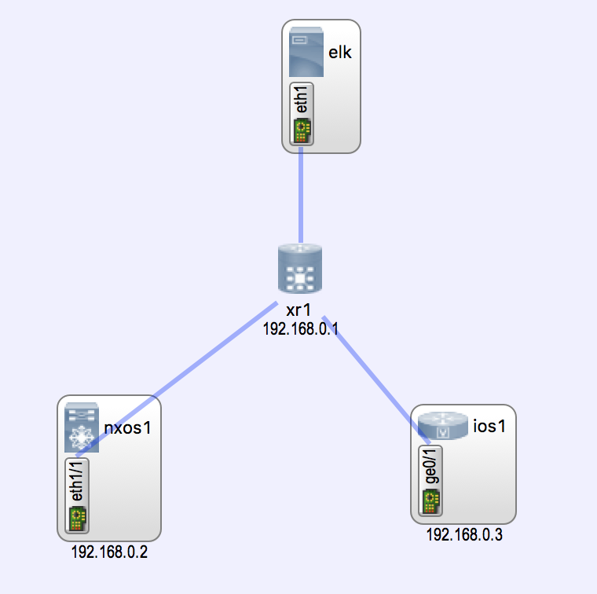
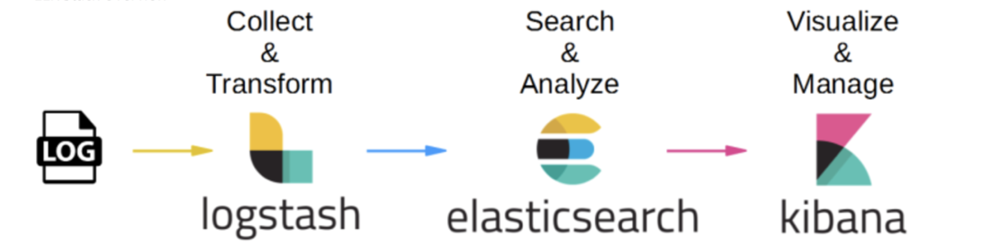

# log-analytics

Demonstrates how to use ELK Stack to monitor logs from network devices.

## Running / Usage

The entire demo is provided as  a [topology.virl](./topology.virl) you can launch it
by simply typing `virl up` in this directory.

## Network topology

The network topology is provided by virl as defined in [topology.virl](./topology.virl)



## Log Analytics - Technology Stack

For log analytics we are using the ELK stack



The grafana ui can be found at http://mgmt-ip-of-elk-server:3000
You can find the management IP of the elk server node in your simulation using `virl nodes`

## Device Configuration

The following configuration is placed on all the  nodes
via the [topology.virl](./topology.virl) file


### xr1 configuration

```
loggng

```

### nxos1 configuration

```
logging
```

### nxos1 configuration

```
logging
```
