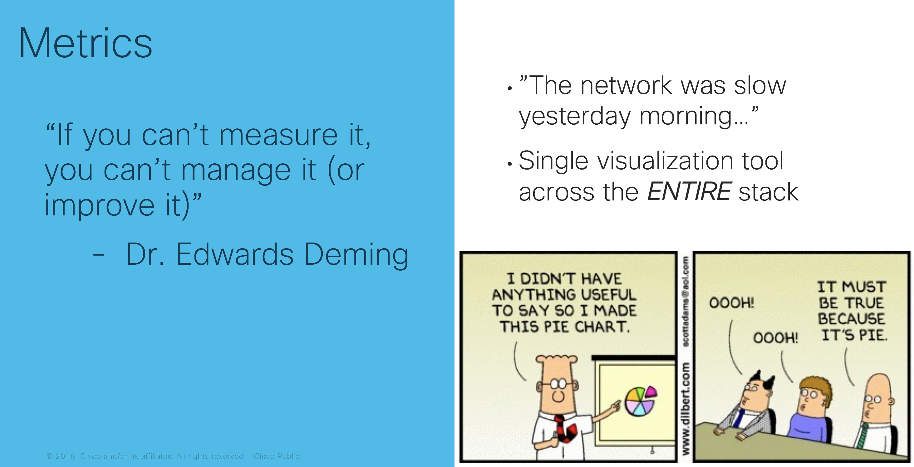
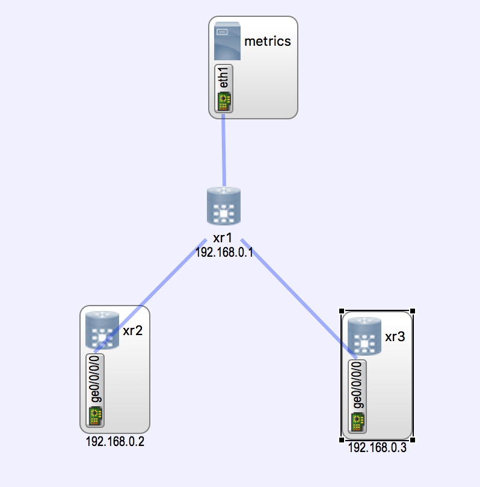
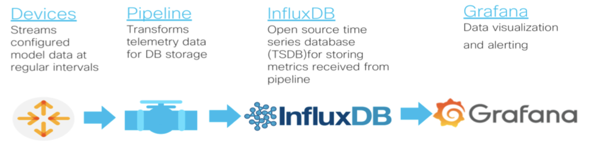

# metrics

Demonstrates how streaming telemetry on Cisco IOS-XR devices can be incorporated into a metrics pipeline.



## Running / Usage

The entire demo is provided as  a [topology.virl](./topology.virl) you can launch it
by simply typing `virl up` in this directory.

## Network topology

The network topology is provided by virl as defined in [topology.virl](./topology.virl)



## Metrics Pipeline - Technology Stack

The metrics pipeline is installed on the metrics server in the topology.  



The grafana ui can be found at http://mgmt-ip-of-metrics-server:3000
You can find the management IP of the metrics server node in your simulation using `virl nodes`

## IOS-XR Configuration

The following model-driven telemetry configuration is placed on all the XR nodes
via the [topology.virl](./topology.virl) file


```

telemetry model-driven
 destination-group PIPELINE
  address-family ipv4 10.0.0.5 port 5432
   encoding self-describing-gpb
   protocol tcp
  !
 !
 sensor-group CPU
  sensor-path Cisco-IOS-XR-wdsysmon-fd-oper:system-monitoring/cpu-utilization
 !
 sensor-group OSPF
  sensor-path Cisco-IOS-XR-ipv4-ospf-oper:ospf/processes/process/default-vrf/ospf-summary
 !
 sensor-group BGP
  sensor-path Cisco-IOS-XR-ipv4-bgp-oper:bgp/instances/instance/instance-active/default-vrf/process-info
  sensor-path Cisco-IOS-XR-ipv4-bgp-oper:bgp/instances/instance/instance-active/default-vrf/afs/af/af-process-info/global
 !
 sensor-group BGP-RIB
  sensor-path Cisco-IOS-XR-ip-rib-ipv4-oper:rib/vrfs/vrf/afs/af/safs/saf/ip-rib-route-table-names/ip-rib-route-table-name/protocol/bgp/as/information
  sensor-path Cisco-IOS-XR-ip-rib-ipv4-oper:rib/vrfs/vrf/afs/af/safs/saf/ip-rib-route-table-names/ip-rib-route-table-name/protocol/connected/non-as/information
!
 sensor-group INTFS
  sensor-path Cisco-IOS-XR-infra-statsd-oper:infra-statistics/interfaces/interface/latest/data-rate
  sensor-path Cisco-IOS-XR-infra-statsd-oper:infra-statistics/interfaces/interface/latest/generic-counters
 !
 sensor-group MEMORY
  sensor-path Cisco-IOS-XR-nto-misc-oper:memory-summary/nodes/node/summary
 !
 sensor-group ROUTING
  sensor-path Cisco-IOS-XR-ip-rib-ipv4-oper:rib/rib-table-ids/rib-table-id/summary-protos
 !
 subscription SUB1
  sensor-group-id CPU sample-interval 10000
  sensor-group-id OSPF sample-interval 10000
  sensor-group-id BGP sample-interval 10000
  sensor-group-id BGP-RIB sample-interval 10000

  sensor-group-id INTFS sample-interval 10000
  sensor-group-id MEMORY sample-interval 10000
  sensor-group-id ROUTING sample-interval 10000
  destination-id PIPELINE
```


## Party On, Wayne!

To get you started quickly, we've added some very common charts / telemetry configuration.  You can now explore adding your own metrics and graphs.
