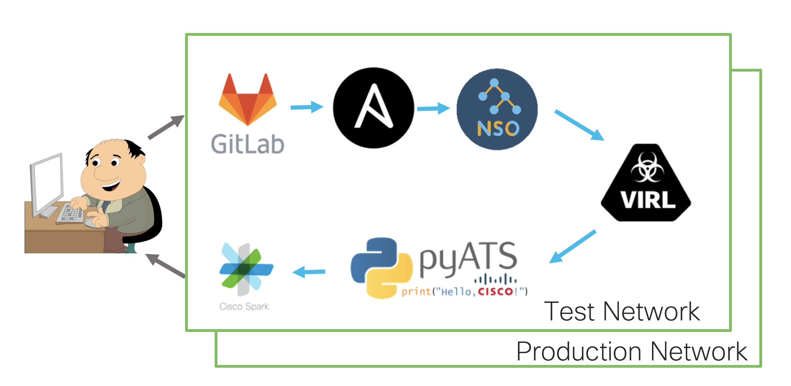

# network-cicd

Use Gitlab to create a full CI-CD pipeline

## Prerequisites

This lab requires you to have the [gitlab stack](../gitlab) running on your devbox

## Pipeline Technology Stack



## setup

This following script should cover all the initial installation

```
./setup.sh
```


## Getting started

You should be able to see your infrastructure as code repository at http://10.10.20.20/developer/network-cicd
